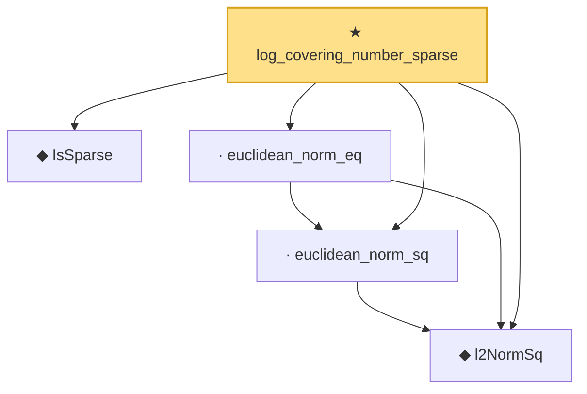

# Proof narrative — log_covering_number_sparse

Root: **log_covering_number_sparse** (theorem) `Statlib/HighDim/Geometry/CoveringNumbers.lean:1626` · topic `HighDim`
Closure: 5 declarations across 3 files. Generated from `proof_graph.json` — no files were moved.

Reading order (foundations first, headline last):

  ◆ `IsSparse` — def · `Statlib/HighDim/Vocabulary/Sparse.lean:36`  _(also used by 49: threshold_head_quadratic_remainder_abs_from_bilinear_l2_tail, subgaussian_l1_shell_localized_centered_tail_from_sparse_approximation_cover, subgaussian_l1_shell_localized_centered_tail_from_sparse_ball_approximation_cover, …)_
  ◆ `l2NormSq` — noncomputable def · `Statlib/HighDim/Vocabulary/Norms.lean:13`  _(also used by 219: matrixRowVec_norm_sq, offDiagCoeffVec_norm_sq_le_frobenius, offDiagCoeffVec_norm_sq_integral_le_frobenius, …)_
  · `euclidean_norm_sq` — lemma · `Statlib/HighDim/Vocabulary/Norms.lean:89`  _(also used by 30: matrixRowVec_norm_sq, offDiagCoeffVec_norm_sq_le_frobenius, offDiagCoeffVec_norm_sq_integral_le_frobenius, …)_
  · `euclidean_norm_eq` — lemma · `Statlib/HighDim/Vocabulary/Norms.lean:95`  _(also used by 4: covering_number_sparse_ball, extendByEquiv_norm, nuclear_norm_le_sqrt_rank_mul_frobenius, …)_
★ `log_covering_number_sparse` — theorem · `Statlib/HighDim/Geometry/CoveringNumbers.lean:1626` **← headline**

## Dependency diagram

```mermaid
flowchart TD
  n0["◆ IsSparse"]
  n1["◆ l2NormSq"]
  n2["· euclidean_norm_sq"]
  n3["· euclidean_norm_eq"]
  n4["★ log_covering_number_sparse"]
  n2 --> n1
  n3 --> n1
  n3 --> n2
  n4 --> n0
  n4 --> n1
  n4 --> n2
  n4 --> n3
  class n4 headline;
  classDef headline fill:#ffe08a,stroke:#d4a017,stroke-width:2px;
  classDef axiomNode fill:#ffd0d0,stroke:#c0392b,stroke-dasharray:4 2;
```
