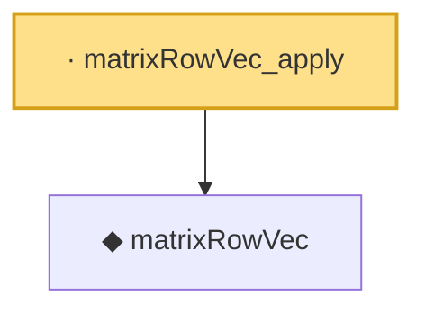

# Proof narrative — matrixRowVec_apply

Root: **matrixRowVec_apply** (lemma) `Statlib/HighDim/Concentration/HansonWright.lean:410` · topic `HighDim`
Closure: 2 declarations across 2 files. Generated from `proof_graph.json` — no files were moved.

Reading order (foundations first, headline last):

  ◆ `matrixRowVec` — noncomputable def · `Statlib/HighDim/Vocabulary/QuadraticForms.lean:62`  _(also used by 5: matrixRowVec_norm_sq, offDiagCoeffVec_apply_eq_inner_row_zeroDiag, offDiagCoeffVec_norm_sq_le_frobenius, …)_
· `matrixRowVec_apply` — lemma · `Statlib/HighDim/Concentration/HansonWright.lean:410` **← headline**

## Dependency diagram

