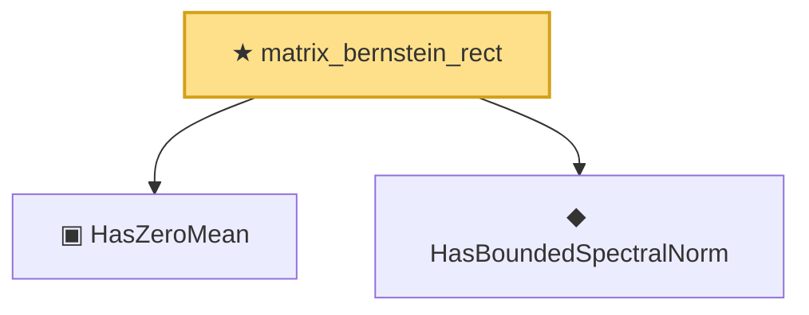

# Proof narrative — matrix_bernstein_rect

Root: **matrix_bernstein_rect** (theorem) `Statlib/HighDim/MatrixBernstein.lean:70` · topic `HighDim`
Closure: 3 declarations across 2 files. Generated from `proof_graph.json` — no files were moved.

Reading order (foundations first, headline last):

  ▣ `HasZeroMean` — structure · `Statlib/Vocabulary/RandomMatrix.lean:62`  _(also used by 1: matrix_bernstein)_
  ◆ `HasBoundedSpectralNorm` — def · `Statlib/Vocabulary/RandomMatrix.lean:38`  _(also used by 1: matrix_bernstein)_
★ `matrix_bernstein_rect` — theorem · `Statlib/HighDim/MatrixBernstein.lean:70` **← headline**

## Dependency diagram

