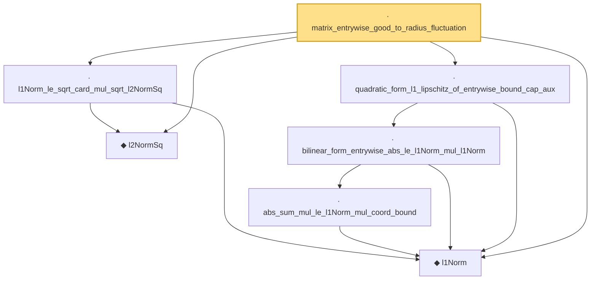

# Proof narrative — matrix_entrywise_good_to_radius_fluctuation

Root: **matrix_entrywise_good_to_radius_fluctuation** (lemma) `Statlib/HighDim/CovarianceMatrix/L1QuadraticProcess/RadiusFluctuation.lean:619` · topic `HighDim`
Closure: 7 declarations across 3 files. Generated from `proof_graph.json` — no files were moved.

Reading order (foundations first, headline last):

  ◆ `l1Norm` — noncomputable def · `Statlib/HighDim/Vocabulary/Norms.lean:17`  _(also used by 200: l1_linear_rademacher_complexity_bound, finite_l1_quadratic_rademacher_coord_bound, finite_l1_quadratic_rademacher_coord_energy_bound, …)_
  ◆ `l2NormSq` — noncomputable def · `Statlib/HighDim/Vocabulary/Norms.lean:13`  _(also used by 220: matrixRowVec_norm_sq, offDiagCoeffVec_norm_sq_le_frobenius, offDiagCoeffVec_norm_sq_integral_le_frobenius, …)_
  · `l1Norm_le_sqrt_card_mul_sqrt_l2NormSq` — lemma · `Statlib/HighDim/CovarianceMatrix/L1QuadraticProcess.lean:6215`  _(also used by 4: bilinear_form_entrywise_abs_le_card_mul_sqrt_l2NormSq, l2_radius_to_l1_radius, cover_center_l1_bound_from_l2_radius, …)_
      · `abs_sum_mul_le_l1Norm_mul_coord_bound` — lemma · `Statlib/HighDim/Vocabulary/Norms.lean:38`  _(also used by 6: l1_linear_rademacher_complexity_bound, finite_l1_quadratic_rademacher_coord_bound, finite_l1_quadratic_rademacher_sample_envelope_entrywise_good_bound, …)_
    · `bilinear_form_entrywise_abs_le_l1Norm_mul_l1Norm` — lemma · `Statlib/HighDim/CovarianceMatrix/L1QuadraticProcess.lean:1117`  _(also used by 5: quadratic_form_l1_lipschitz_of_entrywise_bound, bilinear_form_entrywise_abs_le_card_mul_sqrt_l2NormSq, quadratic_form_l1_lipschitz_of_entrywise_bound_cap, …)_
  · `quadratic_form_l1_lipschitz_of_entrywise_bound_cap_aux` — private lemma · `Statlib/HighDim/CovarianceMatrix/L1QuadraticProcess/RadiusFluctuation.lean:524`
· `matrix_entrywise_good_to_radius_fluctuation` — lemma · `Statlib/HighDim/CovarianceMatrix/L1QuadraticProcess/RadiusFluctuation.lean:619` **← headline**

## Dependency diagram

