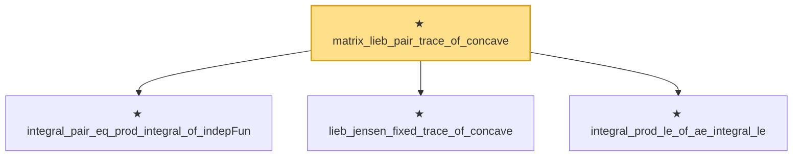

# Proof narrative — matrix_lieb_pair_trace_of_concave

Root: **matrix_lieb_pair_trace_of_concave** (private theorem) `Statlib/HighDim/Concentration/MatrixBernstein.lean:1749` · topic `HighDim`
Closure: 4 declarations across 1 files. Generated from `proof_graph.json` — no files were moved.

Reading order (foundations first, headline last):

  ★ `integral_pair_eq_prod_integral_of_indepFun` — private theorem · `Statlib/HighDim/Concentration/MatrixBernstein.lean:1693`
  ★ `lieb_jensen_fixed_trace_of_concave` — private theorem · `Statlib/HighDim/Concentration/MatrixBernstein.lean:1714`
  ★ `integral_prod_le_of_ae_integral_le` — private theorem · `Statlib/HighDim/Concentration/MatrixBernstein.lean:1735`
★ `matrix_lieb_pair_trace_of_concave` — private theorem · `Statlib/HighDim/Concentration/MatrixBernstein.lean:1749` **← headline**

## Dependency diagram

