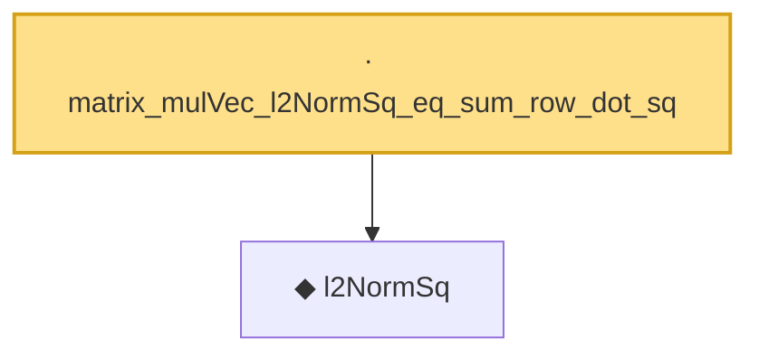

# Proof narrative — matrix_mulVec_l2NormSq_eq_sum_row_dot_sq

Root: **matrix_mulVec_l2NormSq_eq_sum_row_dot_sq** (lemma) `Statlib/HighDim/CovarianceMatrix/L1QuadraticProcess.lean:904` · topic `HighDim`
Closure: 2 declarations across 2 files. Generated from `proof_graph.json` — no files were moved.

Reading order (foundations first, headline last):

  ◆ `l2NormSq` — noncomputable def · `Statlib/HighDim/Vocabulary/Norms.lean:13`  _(also used by 221: matrixRowVec_norm_sq, offDiagCoeffVec_norm_sq_le_frobenius, offDiagCoeffVec_norm_sq_integral_le_frobenius, …)_
· `matrix_mulVec_l2NormSq_eq_sum_row_dot_sq` — lemma · `Statlib/HighDim/CovarianceMatrix/L1QuadraticProcess.lean:904` **← headline**

## Dependency diagram

