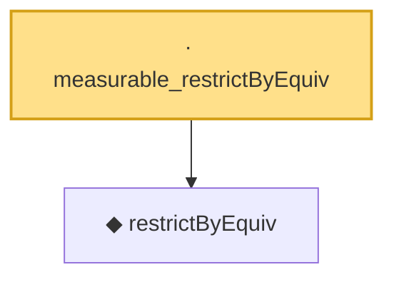

# Proof narrative — measurable_restrictByEquiv

Root: **measurable_restrictByEquiv** (lemma) `Statlib/HighDim/Geometry/RIPConstruction.lean:333` · topic `HighDim`
Closure: 2 declarations across 2 files. Generated from `proof_graph.json` — no files were moved.

Reading order (foundations first, headline last):

  ◆ `restrictByEquiv` — def · `Statlib/HighDim/Vocabulary/Restrictions.lean:15`  _(also used by 10: restrictByEquiv_hasMean_zero, restrictByEquiv_cov_identity, extendByEquiv_restrictByEquiv_of_support, …)_
· `measurable_restrictByEquiv` — lemma · `Statlib/HighDim/Geometry/RIPConstruction.lean:333` **← headline**

## Dependency diagram

