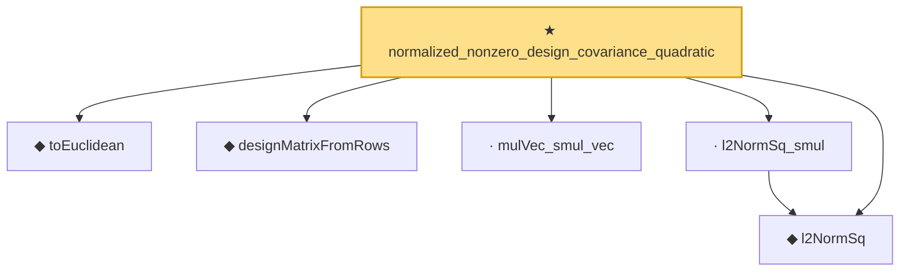

# Proof narrative — normalized_nonzero_design_covariance_quadratic

Root: **normalized_nonzero_design_covariance_quadratic** (theorem) `Statlib/HighDim/Regression/SampleCovarianceDesignBridge.lean:32` · topic `HighDim`
Closure: 6 declarations across 3 files. Generated from `proof_graph.json` — no files were moved.

Reading order (foundations first, headline last):

  ◆ `toEuclidean` — noncomputable def · `Statlib/HighDim/Vocabulary/Norms.lean:109`  _(also used by 19: sampleSecondMoment_quadratic_eq_l2NormSq_div, sampleSecondMoment_unit_direction_lower_tail_double_sum, hermitian_norm_le_two_net_sup, …)_
  ◆ `l2NormSq` — noncomputable def · `Statlib/HighDim/Vocabulary/Norms.lean:13`  _(also used by 220: matrixRowVec_norm_sq, offDiagCoeffVec_norm_sq_le_frobenius, offDiagCoeffVec_norm_sq_integral_le_frobenius, …)_
  ◆ `designMatrixFromRows` — noncomputable def · `Statlib/HighDim/Regression/SampleCovarianceDesignBridge.lean:25`  _(also used by 7: design_l2NormSq_div_eq_sampleSecondMoment_quadratic, sampleSecondMoment_lower_to_SatisfiesUniformRE, sampleSecondMoment_lower_to_SatisfiesUniformSupportRE, …)_
  · `mulVec_smul_vec` — lemma · `Statlib/HighDim/Geometry/RIPConstruction.lean:198`  _(also used by 1: subgaussian_rip_tail)_
  · `l2NormSq_smul` — lemma · `Statlib/HighDim/Geometry/RIPConstruction.lean:190`  _(also used by 1: subgaussian_rip_tail)_
★ `normalized_nonzero_design_covariance_quadratic` — theorem · `Statlib/HighDim/Regression/SampleCovarianceDesignBridge.lean:32` **← headline**

## Dependency diagram

