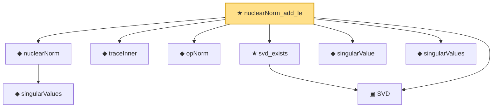

# Proof narrative — nuclearNorm_add_le

Root: **nuclearNorm_add_le** (theorem) `Statlib/HighDim/MatrixAnalysis/NuclearNormProperties.lean:171` · topic `HighDim`
Closure: 9 declarations across 4 files. Generated from `proof_graph.json` — no files were moved.

Reading order (foundations first, headline last):

    ◆ `singularValues` — noncomputable def · `Statlib/HighDim/Vocabulary/SVD.lean:108`  _(also used by 2: svd_sorted_exists, leftSingularVectors)_
  ◆ `nuclearNorm` — noncomputable def · `Statlib/HighDim/Vocabulary/SVD.lean:151`  _(also used by 9: nuclear_norm_le_sqrt_rank_mul_frobenius, nuclearNorm_nonneg, nuclearNorm_eq_iSup_opNorm_le_one, …)_
  ◆ `traceInner` — noncomputable def · `Statlib/HighDim/MatrixAnalysis/NuclearNormProperties.lean:18`  _(also used by 6: nuclearNorm_eq_iSup_opNorm_le_one, trace_dual_nuclear_op, svSoftThreshold_eq_prox_nuclearNorm, …)_
  ◆ `opNorm` — noncomputable def · `Statlib/HighDim/MatrixAnalysis/NuclearNormProperties.lean:13`  _(also used by 20: nuclearNorm_eq_iSup_opNorm_le_one, trace_dual_nuclear_op, svSoftThreshold_eq_prox_nuclearNorm, …)_
  ▣ `SVD` — structure · `Statlib/HighDim/Vocabulary/SVD.lean:37`  _(also used by 35: sorted_svd_exists, sv_diag_singularValues, low_rank_frobenius_error_decomposition, …)_
  ★ `svd_exists` — theorem · `Statlib/HighDim/MatrixAnalysis/SVDFoundation.lean:20`  _(also used by 7: sorted_svd_exists, nuclearNorm_eq_iSup_opNorm_le_one, svSoftThreshold, …)_
  ◆ `singularValue` — def · `Statlib/HighDim/Vocabulary/SVD.lean:79`  _(also used by 23: nuclearNorm_eq_iSup_opNorm_le_one, von_neumann_trace_inequality, svd_rank1_decomposition, …)_
  ◆ `singularValues` — noncomputable def · `Statlib/HighDim/MatrixAnalysis/SingularValueProperties.lean:22`  _(also used by 22: frobenius_norm_svd_relation, sorted_svd_exists, ky_fan_singular_values_product, …)_
★ `nuclearNorm_add_le` — theorem · `Statlib/HighDim/MatrixAnalysis/NuclearNormProperties.lean:171` **← headline**

## Dependency diagram

