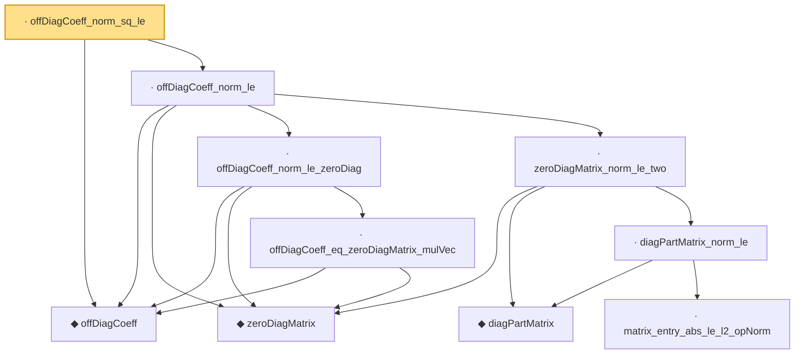

# Proof narrative — offDiagCoeff_norm_sq_le

Root: **offDiagCoeff_norm_sq_le** (lemma) `Statlib/HighDim/Concentration/HansonWright.lean:696` · topic `HighDim`
Closure: 10 declarations across 2 files. Generated from `proof_graph.json` — no files were moved.

Reading order (foundations first, headline last):

  ◆ `offDiagCoeff` — noncomputable def · `Statlib/HighDim/Vocabulary/QuadraticForms.lean:39`  _(also used by 3: offDiagCoeff_const, decoupledOffDiagQuadForm_eq_sum_coeff, decoupledOffDiagQuadForm_eq_inner_coeff)_
    ◆ `zeroDiagMatrix` — def · `Statlib/HighDim/Vocabulary/QuadraticForms.lean:52`  _(also used by 37: offDiagCoeffVec_eq_zeroDiagMatrix_mulVec, offDiagCoeffVec_norm_le_zeroDiag, diagQuadForm_zeroDiagMatrix, …)_
      · `offDiagCoeff_eq_zeroDiagMatrix_mulVec` — lemma · `Statlib/HighDim/Concentration/HansonWright.lean:169`
    · `offDiagCoeff_norm_le_zeroDiag` — lemma · `Statlib/HighDim/Concentration/HansonWright.lean:195`
      ◆ `diagPartMatrix` — def · `Statlib/HighDim/Vocabulary/QuadraticForms.lean:57`  _(also used by 1: zeroDiagMatrix_add_diagPartMatrix)_
        · `matrix_entry_abs_le_l2_opNorm` — lemma · `Statlib/HighDim/Concentration/HansonWright.lean:350`  _(also used by 1: diag_hanson_wright_tail_high)_
      · `diagPartMatrix_norm_le` — lemma · `Statlib/HighDim/Concentration/HansonWright.lean:637`
    · `zeroDiagMatrix_norm_le_two` — lemma · `Statlib/HighDim/Concentration/HansonWright.lean:656`  _(also used by 2: offDiagCoeffVec_norm_le, zeroDiag_hanson_scale_half_le)_
  · `offDiagCoeff_norm_le` — lemma · `Statlib/HighDim/Concentration/HansonWright.lean:673`
· `offDiagCoeff_norm_sq_le` — lemma · `Statlib/HighDim/Concentration/HansonWright.lean:696` **← headline**

## Dependency diagram

