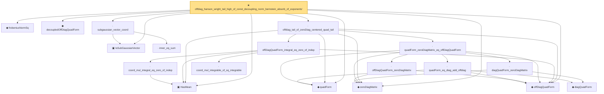

# Proof narrative — offdiag_hanson_wright_tail_high_of_const_decoupling_norm_bernstein_absorb_of_exponents'

Root: **offdiag_hanson_wright_tail_high_of_const_decoupling_norm_bernstein_absorb_of_exponents'** (theorem) `Statlib/HighDim/Concentration/HansonWright.lean:3746` · topic `HighDim`
Closure: 19 declarations across 4 files. Generated from `proof_graph.json` — no files were moved.

Reading order (foundations first, headline last):

  ▣ `HasMean` — structure · `Statlib/HighDim/Vocabulary/RandomVector.lean:83`  _(also used by 35: offDiagQuadForm_centered_eq_self_of_indep, coord_mul_subexponential_exists_of_indep, coord_mul_scaled_subexponential_exists_of_indep, …)_
  ▣ `IsSubGaussianVector` — structure · `Statlib/HighDim/Vocabulary/RandomVector.lean:52`  _(also used by 77: decoupledOffDiagQuadForm_const_right_subgaussian, decoupledOffDiagQuadForm_const_right_abs_tail_real, decoupledOffDiagQuadForm_prod_first_section_abs_tail_real, …)_
  ◆ `frobeniusNormSq` — noncomputable def · `Statlib/HighDim/Vocabulary/Norms.lean:37`  _(also used by 43: diag_sq_sum_le_frobeniusNormSq, frobeniusNormSq_zeroDiagMatrix_le, frobeniusNormSq_nonneg, …)_
  ◆ `quadForm` — noncomputable def · `Statlib/HighDim/Vocabulary/QuadraticForms.lean:15`  _(also used by 28: quadForm_centered_eq_diag_offdiag_centered, quadForm_centered_tail_le_diag_offdiag_tail, quadForm_centered_tail_le_two_mul_of_diag_offdiag_tail_bounds, …)_
  ◆ `zeroDiagMatrix` — def · `Statlib/HighDim/Vocabulary/QuadraticForms.lean:52`  _(also used by 36: offDiagCoeff_eq_zeroDiagMatrix_mulVec, offDiagCoeff_norm_le_zeroDiag, offDiagCoeffVec_eq_zeroDiagMatrix_mulVec, …)_
  ◆ `decoupledOffDiagQuadForm` — noncomputable def · `Statlib/HighDim/Vocabulary/QuadraticForms.lean:33`  _(also used by 48: decoupledOffDiagQuadForm_eq_sum_coeff, decoupledOffDiagQuadForm_eq_inner_coeff, decoupledOffDiagQuadForm_const_right_eq_inner_coeffVec, …)_
  ◆ `offDiagQuadForm` — noncomputable def · `Statlib/HighDim/Vocabulary/QuadraticForms.lean:27`  _(also used by 17: offDiagQuadForm_eq_zero_of_entries, quadForm_centered_eq_diag_offdiag_centered, offDiagQuadForm_integrable_of_coord_sq_integrable, …)_
    · `inner_eq_sum` — lemma · `Statlib/HighDim/Vocabulary/Norms.lean:32`  _(also used by 15: decoupledOffDiagQuadForm_eq_inner_coeff, offDiagCoeffVec_apply_eq_inner_row_zeroDiag, subgaussian_norm_sq_mean_le_dim, …)_
  · `subgaussian_vector_coord` — lemma · `Statlib/HighDim/Concentration/HansonWright.lean:1341`  _(also used by 18: coord_mul_subexponential_exists_of_indep, coord_sq_centered_mgf_bound, coord_sq_centered_mgf_bound_explicit, …)_
        ◆ `diagQuadForm` — noncomputable def · `Statlib/HighDim/Vocabulary/QuadraticForms.lean:21`  _(also used by 8: quadForm_centered_eq_diag_offdiag_centered, diagQuadForm_centered_eq_sum, quadForm_centered_tail_le_diag_offdiag_tail, …)_
      · `quadForm_eq_diag_add_offdiag` — lemma · `Statlib/HighDim/Concentration/HansonWright.lean:236`  _(also used by 1: quadForm_centered_eq_diag_offdiag_centered)_
      · `diagQuadForm_zeroDiagMatrix` — lemma · `Statlib/HighDim/Concentration/HansonWright.lean:254`
      · `offDiagQuadForm_zeroDiagMatrix` — lemma · `Statlib/HighDim/Concentration/HansonWright.lean:260`
    · `quadForm_zeroDiagMatrix_eq_offDiagQuadForm` — lemma · `Statlib/HighDim/Concentration/HansonWright.lean:271`  _(also used by 1: zeroDiag_centered_quadratic_form_tail_high_of_offdiag_entries_zero)_
      · `coord_mul_integrable_of_sq_integrable` — lemma · `Statlib/HighDim/Concentration/HansonWright.lean:1232`  _(also used by 1: offDiagQuadForm_integrable_of_coord_sq_integrable)_
      · `coord_mul_integral_eq_zero_of_indep` — lemma · `Statlib/HighDim/Concentration/HansonWright.lean:1249`  _(also used by 1: coord_mul_subexponential_exists_of_indep)_
    · `offDiagQuadForm_integral_eq_zero_of_indep` — lemma · `Statlib/HighDim/Concentration/HansonWright.lean:1283`  _(also used by 1: offDiagQuadForm_centered_eq_self_of_indep)_
  · `offdiag_tail_of_zeroDiag_centered_quad_tail` — lemma · `Statlib/HighDim/Concentration/HansonWright.lean:2885`  _(also used by 6: offdiag_hanson_wright_tail_high_norm_bernstein_of_decoupling, offdiag_hanson_wright_tail_high_norm_bernstein_of_const_decoupling, offdiag_hanson_wright_tail_high_of_const_decoupling_norm_bernstein_absorb, …)_
★ `offdiag_hanson_wright_tail_high_of_const_decoupling_norm_bernstein_absorb_of_exponents'` — theorem · `Statlib/HighDim/Concentration/HansonWright.lean:3746` **← headline**

## Dependency diagram

