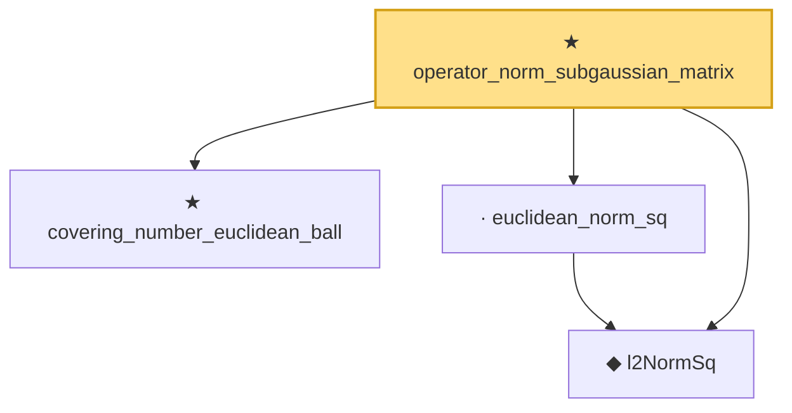

# Proof narrative — operator_norm_subgaussian_matrix

Root: **operator_norm_subgaussian_matrix** (theorem) `Statlib/HighDim/Concentration/OperatorNormSubgaussian.lean:26` · topic `HighDim`
Closure: 4 declarations across 3 files. Generated from `proof_graph.json` — no files were moved.

Reading order (foundations first, headline last):

  ★ `covering_number_euclidean_ball` — theorem · `Statlib/HighDim/Geometry/CoveringNumbers.lean:42`  _(also used by 1: covering_number_sparse_ball)_
  ◆ `l2NormSq` — noncomputable def · `Statlib/HighDim/Vocabulary/Norms.lean:13`  _(also used by 55: matrixRowVec_norm_sq, offDiagCoeffVec_norm_sq_le_frobenius, offDiagCoeffVec_norm_sq_integral_le_frobenius, …)_
  · `euclidean_norm_sq` — lemma · `Statlib/HighDim/Vocabulary/Norms.lean:21`  _(also used by 14: matrixRowVec_norm_sq, offDiagCoeffVec_norm_sq_le_frobenius, offDiagCoeffVec_norm_sq_integral_le_frobenius, …)_
★ `operator_norm_subgaussian_matrix` — theorem · `Statlib/HighDim/Concentration/OperatorNormSubgaussian.lean:26` **← headline**

## Dependency diagram

