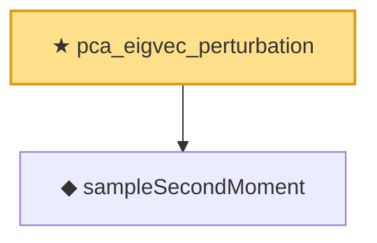

# Proof narrative — pca_eigvec_perturbation

Root: **pca_eigvec_perturbation** (theorem) `Statlib/HighDim/SpectralPerturbation.lean:170` · topic `HighDim`
Closure: 2 declarations across 2 files. Generated from `proof_graph.json` — no files were moved.

Reading order (foundations first, headline last):

  ◆ `sampleSecondMoment` — noncomputable def · `Statlib/HighDim/SampleCovariance.lean:41`  _(also used by 3: sampleSecondMoment_unbiased, sampleCovariance_concentration, sampleCovariance_confidence)_
★ `pca_eigvec_perturbation` — theorem · `Statlib/HighDim/SpectralPerturbation.lean:170` **← headline**

## Dependency diagram

