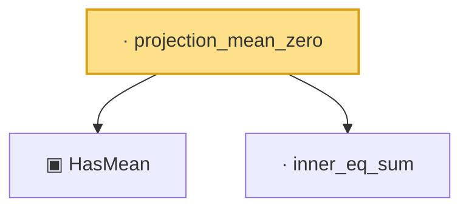

# Proof narrative — projection_mean_zero

Root: **projection_mean_zero** (lemma) `Statlib/HighDim/CovarianceMatrix/SampleCovariance.lean:236` · topic `HighDim`
Closure: 3 declarations across 3 files. Generated from `proof_graph.json` — no files were moved.

Reading order (foundations first, headline last):

  ▣ `HasMean` — structure · `Statlib/HighDim/Vocabulary/RandomVector.lean:83`  _(also used by 38: coord_mul_integral_eq_zero_of_indep, offDiagQuadForm_integral_eq_zero_of_indep, offDiagQuadForm_centered_eq_self_of_indep, …)_
  · `inner_eq_sum` — lemma · `Statlib/HighDim/Vocabulary/Norms.lean:32`  _(also used by 15: decoupledOffDiagQuadForm_eq_inner_coeff, offDiagCoeffVec_apply_eq_inner_row_zeroDiag, subgaussian_vector_coord, …)_
· `projection_mean_zero` — lemma · `Statlib/HighDim/CovarianceMatrix/SampleCovariance.lean:236` **← headline**

## Dependency diagram

