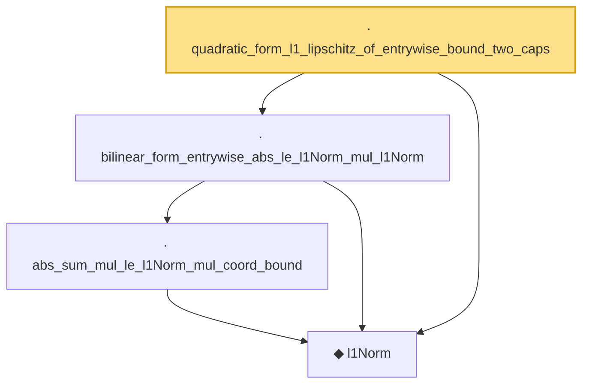

# Proof narrative — quadratic_form_l1_lipschitz_of_entrywise_bound_two_caps

Root: **quadratic_form_l1_lipschitz_of_entrywise_bound_two_caps** (lemma) `Statlib/HighDim/CovarianceMatrix/L1QuadraticProcess/RadiusFluctuation.lean:748` · topic `HighDim`
Closure: 4 declarations across 3 files. Generated from `proof_graph.json` — no files were moved.

Reading order (foundations first, headline last):

  ◆ `l1Norm` — noncomputable def · `Statlib/HighDim/Vocabulary/Norms.lean:17`  _(also used by 202: l1_linear_rademacher_complexity_bound, finite_l1_quadratic_rademacher_coord_bound, finite_l1_quadratic_rademacher_coord_energy_bound, …)_
    · `abs_sum_mul_le_l1Norm_mul_coord_bound` — lemma · `Statlib/HighDim/Vocabulary/Norms.lean:38`  _(also used by 6: l1_linear_rademacher_complexity_bound, finite_l1_quadratic_rademacher_coord_bound, finite_l1_quadratic_rademacher_sample_envelope_entrywise_good_bound, …)_
  · `bilinear_form_entrywise_abs_le_l1Norm_mul_l1Norm` — lemma · `Statlib/HighDim/CovarianceMatrix/L1QuadraticProcess.lean:1117`  _(also used by 5: quadratic_form_l1_lipschitz_of_entrywise_bound, bilinear_form_entrywise_abs_le_card_mul_sqrt_l2NormSq, quadratic_form_l1_lipschitz_of_entrywise_bound_cap, …)_
· `quadratic_form_l1_lipschitz_of_entrywise_bound_two_caps` — lemma · `Statlib/HighDim/CovarianceMatrix/L1QuadraticProcess/RadiusFluctuation.lean:748` **← headline**

## Dependency diagram

