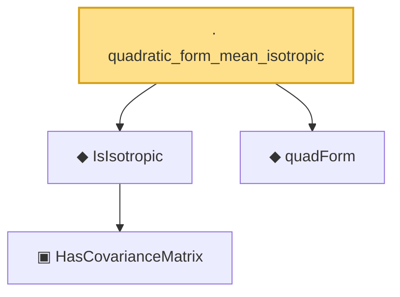

# Proof narrative — quadratic_form_mean_isotropic

Root: **quadratic_form_mean_isotropic** (lemma) `Statlib/HighDim/HansonWright.lean:44` · topic `HighDim`
Closure: 4 declarations across 2 files. Generated from `proof_graph.json` — no files were moved.

Reading order (foundations first, headline last):

    ▣ `HasCovarianceMatrix` — structure · `Statlib/Vocabulary/RandomVector.lean:101`  _(also used by 8: secondMoment_isSymm, secondMoment_posSemidef, secondMoment_eq_cov_centered, …)_
  ◆ `IsIsotropic` — def · `Statlib/Vocabulary/RandomVector.lean:109`  _(also used by 6: hanson_wright_isotropic, subgaussian_norm_sq_subexponential, isotropic_mean_sq_norm, …)_
  ◆ `quadForm` — noncomputable def · `Statlib/HighDim/HansonWright.lean:33`  _(also used by 2: hanson_wright, hanson_wright_isotropic)_
· `quadratic_form_mean_isotropic` — lemma · `Statlib/HighDim/HansonWright.lean:44` **← headline**

## Dependency diagram

