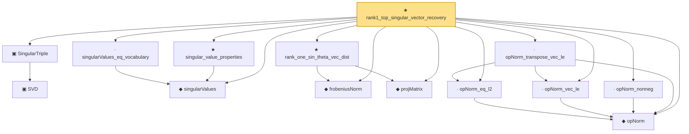

# Proof narrative — rank1_top_singular_vector_recovery

Root: **rank1_top_singular_vector_recovery** (theorem) `Statlib/HighDim/MatrixRecovery/RankOneSpectralInitialization.lean:14` · topic `HighDim`
Closure: 14 declarations across 8 files. Generated from `proof_graph.json` — no files were moved.

Reading order (foundations first, headline last):

  ◆ `opNorm` — noncomputable def · `Statlib/HighDim/MatrixAnalysis/NuclearNormProperties.lean:13`  _(also used by 16: nuclearNorm_add_le, nuclearNorm_eq_iSup_opNorm_le_one, trace_dual_nuclear_op, …)_
    ▣ `SVD` — structure · `Statlib/HighDim/Vocabulary/SVD.lean:37`  _(also used by 36: sorted_svd_exists, sv_diag_singularValues, low_rank_frobenius_error_decomposition, …)_
  ▣ `SingularTriple` — structure · `Statlib/HighDim/Vocabulary/SVD.lean:53`
  ◆ `singularValues` — noncomputable def · `Statlib/HighDim/MatrixAnalysis/SingularValueProperties.lean:22`  _(also used by 20: frobenius_norm_svd_relation, sorted_svd_exists, ky_fan_singular_values_product, …)_
  ◆ `frobeniusNorm` — def · `Statlib/HighDim/MatrixAnalysis/SvSoftThreshold.lean:26`  _(also used by 11: hard_sv_threshold_is_rank_constrained_minimizer, low_rank_frobenius_error_decomposition, nuclear_norm_le_sqrt_rank_mul_frobenius, …)_
  ◆ `projMatrix` — noncomputable def · `Statlib/HighDim/Vocabulary/Spectral.lean:30`
  ★ `rank_one_sin_theta_vec_dist` — theorem · `Statlib/HighDim/MatrixAnalysis/RankOneSinTheta.lean:14`
  · `singularValues_eq_vocabulary` — lemma · `Statlib/HighDim/MatrixAnalysis/SingularValueProperties.lean:30`  _(also used by 7: ky_fan_singular_values_product, sv_diag_singularValues, low_rank_frobenius_error_decomposition, …)_
  ★ `singular_value_properties` — theorem · `Statlib/HighDim/MatrixAnalysis/SingularValueProperties.lean:39`  _(also used by 6: ky_fan_singular_values_product, sv_diag_singularValues, low_rank_frobenius_error_decomposition, …)_
  · `opNorm_eq_l2` — lemma · `Statlib/HighDim/MatrixAnalysis/WedinSinTheta.lean:2561`  _(also used by 1: opNorm_transpose)_
  · `opNorm_vec_le` — lemma · `Statlib/HighDim/MatrixAnalysis/WedinSinTheta.lean:2551`  _(also used by 1: column_alpha_bound)_
  · `opNorm_nonneg` — lemma · `Statlib/HighDim/MatrixAnalysis/WedinSinTheta.lean:2569`  _(also used by 5: column_alpha_bound, wedin_sin_theta, rank_constrained_denoising_frobenius_bound_s2, …)_
  · `opNorm_transpose_vec_le` — lemma · `Statlib/HighDim/MatrixAnalysis/WedinSinTheta.lean:2575`  _(also used by 1: column_alpha_bound)_
★ `rank1_top_singular_vector_recovery` — theorem · `Statlib/HighDim/MatrixRecovery/RankOneSpectralInitialization.lean:14` **← headline**

## Dependency diagram

