# Proof narrative — rank_constrained_denoising_frobenius_bound

Root: **rank_constrained_denoising_frobenius_bound** (theorem) `Statlib/HighDim/MatrixRecovery/RankConstrainedDenoising.lean:2203` · topic `HighDim`
Closure: 35 declarations across 14 files. Generated from `proof_graph.json` — no files were moved.

Reading order (foundations first, headline last):

  ◆ `frobeniusNorm` — def · `Statlib/HighDim/MatrixAnalysis/SvSoftThreshold.lean:26`  _(also used by 9: hard_sv_threshold_is_rank_constrained_minimizer, low_rank_frobenius_error_decomposition, rank_one_sin_theta_vec_dist, …)_
    ◆ `opNorm` — noncomputable def · `Statlib/HighDim/MatrixAnalysis/NuclearNormProperties.lean:13`  _(also used by 15: nuclearNorm_add_le, svSoftThreshold_eq_prox_nuclearNorm, svSoftThreshold_frobenius_non_expansive, …)_
        ★ `covering_number_euclidean_ball` — theorem · `Statlib/HighDim/Geometry/CoveringNumbers.lean:42`  _(also used by 1: covering_number_sparse_ball)_
      ◆ `l2NormSq` — noncomputable def · `Statlib/HighDim/Vocabulary/Norms.lean:13`  _(also used by 215: matrixRowVec_norm_sq, offDiagCoeffVec_norm_sq_le_frobenius, offDiagCoeffVec_norm_sq_integral_le_frobenius, …)_
      · `euclidean_norm_sq` — lemma · `Statlib/HighDim/Vocabulary/Norms.lean:89`  _(also used by 27: matrixRowVec_norm_sq, offDiagCoeffVec_norm_sq_le_frobenius, offDiagCoeffVec_norm_sq_integral_le_frobenius, …)_
      ★ `operator_norm_subgaussian_matrix` — theorem · `Statlib/HighDim/Concentration/OperatorNormSubgaussian.lean:26`  _(also used by 1: rank_constrained_denoising_frobenius_bound_s1)_
          · `norm_normalized_sub_le_two_mul` — lemma · `Statlib/HighDim/Geometry/CoveringNumbers.lean:905`
        · `finset_cover_to_unit_l2_euclidean_cover` — lemma · `Statlib/HighDim/Geometry/CoveringNumbers.lean:940`
      · `covering_number_ball_to_unit_l2_euclidean_cover` — lemma · `Statlib/HighDim/Geometry/CoveringNumbers.lean:1010`  _(also used by 1: indexed_covering_number_ball_to_l1_shell_cover_exists)_
    · `opNorm_nonneg` — lemma · `Statlib/HighDim/MatrixAnalysis/WedinSinTheta.lean:2569`  _(also used by 3: column_alpha_bound, wedin_sin_theta, rank1_top_singular_vector_recovery)_
    ★ `rank_constrained_denoising_frobenius_bound_s1K` — theorem · `Statlib/HighDim/MatrixRecovery/RankConstrainedDenoising.lean:269`
    ◆ `traceInner` — noncomputable def · `Statlib/HighDim/MatrixAnalysis/NuclearNormProperties.lean:18`  _(also used by 3: nuclearNorm_add_le, svSoftThreshold_eq_prox_nuclearNorm, svSoftThreshold_frobenius_non_expansive)_
      ◆ `singularValues` — noncomputable def · `Statlib/HighDim/Vocabulary/SVD.lean:108`  _(also used by 2: svd_sorted_exists, leftSingularVectors)_
    ◆ `nuclearNorm` — noncomputable def · `Statlib/HighDim/Vocabulary/SVD.lean:151`  _(also used by 4: nuclearNorm_add_le, proxObjective, svSoftThreshold_eq_prox_nuclearNorm, …)_
        ▣ `SVD` — structure · `Statlib/HighDim/Vocabulary/SVD.lean:37`  _(also used by 34: sorted_svd_exists, sv_diag_singularValues, low_rank_frobenius_error_decomposition, …)_
        ★ `svd_exists` — theorem · `Statlib/HighDim/MatrixAnalysis/SVDFoundation.lean:20`  _(also used by 7: sorted_svd_exists, nuclearNorm_add_le, svSoftThreshold, …)_
        ◆ `singularValue` — def · `Statlib/HighDim/Vocabulary/SVD.lean:79`  _(also used by 23: nuclearNorm_add_le, von_neumann_trace_inequality, svd_rank1_decomposition, …)_
      ◆ `singularValues` — noncomputable def · `Statlib/HighDim/MatrixAnalysis/SingularValueProperties.lean:22`  _(also used by 18: sorted_svd_exists, ky_fan_singular_values_product, sv_diag_singularValues, …)_
        ★ `svd_singular_values_unique` — theorem · `Statlib/HighDim/MatrixAnalysis/SVDFoundation.lean:663`  _(also used by 4: sv_diag_singularValues, low_rank_frobenius_error_decomposition, von_neumann_trace_inequality, …)_
        ★ `nuclearNorm_nonneg` — theorem · `Statlib/HighDim/MatrixAnalysis/NuclearNormProperties.lean:22`  _(also used by 2: svSoftThreshold_eq_prox_nuclearNorm, svSoftThreshold_frobenius_non_expansive)_
      ★ `nuclearNorm_eq_iSup_opNorm_le_one` — theorem · `Statlib/HighDim/MatrixAnalysis/NuclearNormProperties.lean:1269`  _(also used by 2: svSoftThreshold_eq_prox_nuclearNorm, svSoftThreshold_frobenius_non_expansive)_
    ★ `trace_dual_nuclear_op` — theorem · `Statlib/HighDim/MatrixAnalysis/NuclearNormProperties.lean:2847`  _(also used by 2: svSoftThreshold_eq_prox_nuclearNorm, svSoftThreshold_frobenius_non_expansive)_
      ◆ `IsSparse` — def · `Statlib/HighDim/Vocabulary/Sparse.lean:36`  _(also used by 48: threshold_head_quadratic_remainder_abs_from_bilinear_l2_tail, subgaussian_l1_shell_localized_centered_tail_from_sparse_approximation_cover, subgaussian_l1_shell_localized_centered_tail_from_sparse_ball_approximation_cover, …)_
      ◆ `l1Norm` — noncomputable def · `Statlib/HighDim/Vocabulary/Norms.lean:17`  _(also used by 203: l1_linear_rademacher_complexity_bound, finite_l1_quadratic_rademacher_coord_bound, finite_l1_quadratic_rademacher_coord_energy_bound, …)_
      ◆ `toEuclidean` — noncomputable def · `Statlib/HighDim/Vocabulary/Norms.lean:109`  _(also used by 19: sampleSecondMoment_quadratic_eq_l2NormSq_div, sampleSecondMoment_unit_direction_lower_tail_double_sum, hermitian_norm_le_two_net_sup, …)_
      · `sparse_l1Norm_of_euclidean_le_sqrt_s_mul_norm` — lemma · `Statlib/HighDim/Geometry/CoveringNumbers.lean:813`  _(also used by 2: sparse_euclidean_cover_to_l1_cover, normalized_sparse_euclidean_cover_to_unit_l1_cover)_
      · `euclidean_norm_eq` — lemma · `Statlib/HighDim/Vocabulary/Norms.lean:95`  _(also used by 4: covering_number_sparse_ball, log_covering_number_sparse, extendByEquiv_norm, …)_
      · `singularValues_eq_vocabulary` — lemma · `Statlib/HighDim/MatrixAnalysis/SingularValueProperties.lean:30`  _(also used by 7: ky_fan_singular_values_product, sv_diag_singularValues, low_rank_frobenius_error_decomposition, …)_
      ★ `frobenius_norm_svd_relation` — theorem · `Statlib/HighDim/MatrixAnalysis/FrobeniusNormSvdRelation.lean:11`  _(also used by 3: low_rank_frobenius_error_decomposition, svSoftThreshold_eq_prox_nuclearNorm, svSoftThreshold_frobenius_non_expansive)_
    ★ `nuclear_norm_le_sqrt_rank_mul_frobenius` — theorem · `Statlib/HighDim/MatrixAnalysis/NuclearNormLeSqrtRank.lean:14`
      ◆ `frobeniusNormSq` — noncomputable def · `Statlib/HighDim/Vocabulary/Norms.lean:105`  _(also used by 55: frobenius_norm_sq_subgaussian_concentration, gaussian_quadratic_form_concentration, diag_sq_sum_le_frobeniusNormSq, …)_
      · `frobeniusNormSq_nonneg` — lemma · `Statlib/HighDim/Concentration/HansonWright.lean:402`  _(also used by 3: decoupledOffDiagQuadForm_const_right_abs_tail_real_frobenius, decoupledOffDiagQuadForm_prod_tail_le_markov_plus_good_ofReal, hanson_high_frobenius_pos)_
    ★ `rank_constrained_denoising_frobenius_bound_s2` — theorem · `Statlib/HighDim/MatrixRecovery/RankConstrainedDenoising.lean:55`
  ★ `rank_constrained_denoising_frobenius_bound_s3` — theorem · `Statlib/HighDim/MatrixRecovery/RankConstrainedDenoising.lean:1027`
★ `rank_constrained_denoising_frobenius_bound` — theorem · `Statlib/HighDim/MatrixRecovery/RankConstrainedDenoising.lean:2203` **← headline**

## Dependency diagram

```mermaid
flowchart TD
  n0["◆ frobeniusNorm"]
  n1["◆ opNorm"]
  n2["★ covering_number_euclidean_ball"]
  n3["◆ l2NormSq"]
  n4["· euclidean_norm_sq"]
  n5["★ operator_norm_subgaussian_matrix"]
  n6["· norm_normalized_sub_le_two_mul"]
  n7["· finset_cover_to_unit_l2_euclidean_cover"]
  n8["· covering_number_ball_to_unit_l2_euclidean_cover"]
  n9["· opNorm_nonneg"]
  n10["★ rank_constrained_denoising_frobenius_bound_s1K"]
  n11["◆ traceInner"]
  n12["◆ singularValues"]
  n13["◆ nuclearNorm"]
  n14["▣ SVD"]
  n15["★ svd_exists"]
  n16["◆ singularValue"]
  n17["◆ singularValues"]
  n18["★ svd_singular_values_unique"]
  n19["★ nuclearNorm_nonneg"]
  n20["★ nuclearNorm_eq_iSup_opNorm_le_one"]
  n21["★ trace_dual_nuclear_op"]
  n22["◆ IsSparse"]
  n23["◆ l1Norm"]
  n24["◆ toEuclidean"]
  n25["· sparse_l1Norm_of_euclidean_le_sqrt_s_mul_norm"]
  n26["· euclidean_norm_eq"]
  n27["· singularValues_eq_vocabulary"]
  n28["★ frobenius_norm_svd_relation"]
  n29["★ nuclear_norm_le_sqrt_rank_mul_frobenius"]
  n30["◆ frobeniusNormSq"]
  n31["· frobeniusNormSq_nonneg"]
  n32["★ rank_constrained_denoising_frobenius_bound_s2"]
  n33["★ rank_constrained_denoising_frobenius_bound_s3"]
  n34["★ rank_constrained_denoising_frobenius_bound"]
  n4 --> n3
  n5 --> n2
  n5 --> n4
  n5 --> n3
  n7 --> n6
  n8 --> n2
  n8 --> n7
  n9 --> n1
  n10 --> n1
  n10 --> n5
  n10 --> n8
  n10 --> n4
  n10 --> n3
  n10 --> n9
  n13 --> n12
  n15 --> n14
  n18 --> n14
  n19 --> n13
  n19 --> n17
  n20 --> n13
  n20 --> n1
  n20 --> n11
  n20 --> n14
  n20 --> n15
  n20 --> n16
  n20 --> n4
  n20 --> n3
  n20 --> n17
  n20 --> n18
  n20 --> n19
  n21 --> n11
  n21 --> n13
  n21 --> n1
  n21 --> n20
  n25 --> n22
  n25 --> n23
  n25 --> n3
  n25 --> n4
  n26 --> n3
  n26 --> n4
  n27 --> n17
  n28 --> n17
  n29 --> n13
  n29 --> n0
  n29 --> n22
  n29 --> n17
  n29 --> n23
  n29 --> n3
  n29 --> n24
  n29 --> n25
  n29 --> n26
  n29 --> n27
  n29 --> n28
  n31 --> n30
  n32 --> n0
  n32 --> n1
  n32 --> n11
  n32 --> n30
  n32 --> n31
  n32 --> n13
  n32 --> n21
  n32 --> n29
  n32 --> n9
  n33 --> n0
  n33 --> n10
  n33 --> n1
  n33 --> n11
  n33 --> n13
  n33 --> n21
  n33 --> n29
  n33 --> n9
  n33 --> n32
  n34 --> n0
  n34 --> n33
  class n34 headline;
  classDef headline fill:#ffe08a,stroke:#d4a017,stroke-width:2px;
  classDef axiomNode fill:#ffd0d0,stroke:#c0392b,stroke-dasharray:4 2;
```

