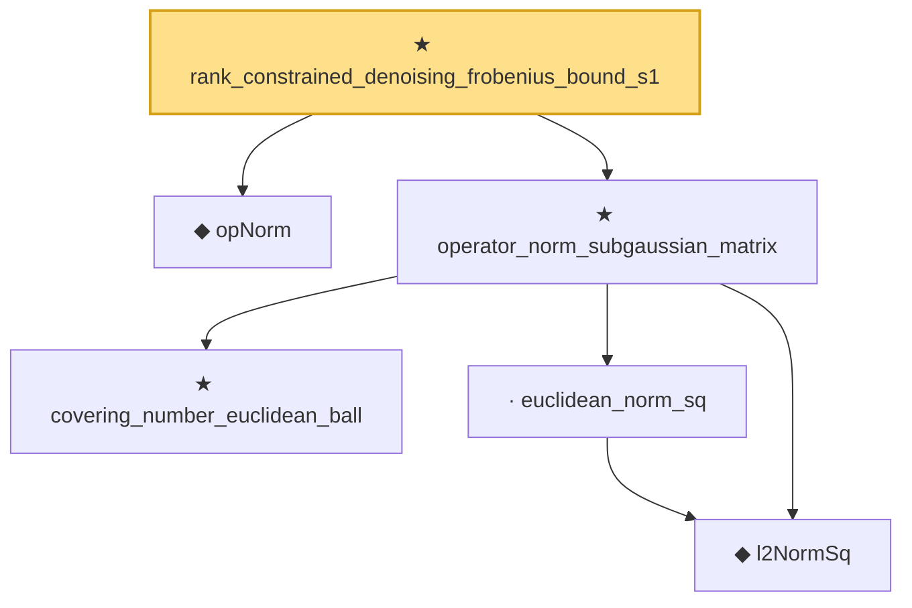

# Proof narrative — rank_constrained_denoising_frobenius_bound_s1

Root: **rank_constrained_denoising_frobenius_bound_s1** (theorem) `Statlib/HighDim/MatrixRecovery/RankConstrainedDenoising.lean:16` · topic `HighDim`
Closure: 6 declarations across 5 files. Generated from `proof_graph.json` — no files were moved.

Reading order (foundations first, headline last):

  ◆ `opNorm` — noncomputable def · `Statlib/HighDim/MatrixAnalysis/NuclearNormProperties.lean:13`  _(also used by 20: nuclearNorm_add_le, nuclearNorm_eq_iSup_opNorm_le_one, trace_dual_nuclear_op, …)_
    ★ `covering_number_euclidean_ball` — theorem · `Statlib/HighDim/Geometry/CoveringNumbers.lean:42`  _(also used by 2: covering_number_sparse_ball, covering_number_ball_to_unit_l2_euclidean_cover)_
    ◆ `l2NormSq` — noncomputable def · `Statlib/HighDim/Vocabulary/Norms.lean:13`  _(also used by 220: matrixRowVec_norm_sq, offDiagCoeffVec_norm_sq_le_frobenius, offDiagCoeffVec_norm_sq_integral_le_frobenius, …)_
    · `euclidean_norm_sq` — lemma · `Statlib/HighDim/Vocabulary/Norms.lean:89`  _(also used by 31: matrixRowVec_norm_sq, offDiagCoeffVec_norm_sq_le_frobenius, offDiagCoeffVec_norm_sq_integral_le_frobenius, …)_
  ★ `operator_norm_subgaussian_matrix` — theorem · `Statlib/HighDim/Concentration/OperatorNormSubgaussian.lean:26`  _(also used by 1: rank_constrained_denoising_frobenius_bound_s1K)_
★ `rank_constrained_denoising_frobenius_bound_s1` — theorem · `Statlib/HighDim/MatrixRecovery/RankConstrainedDenoising.lean:16` **← headline**

## Dependency diagram

