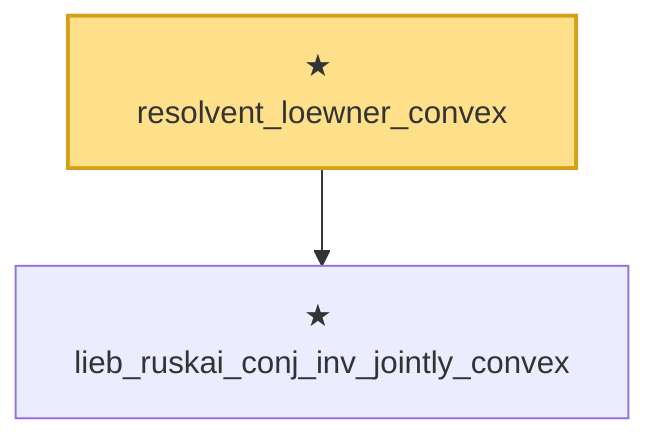

# Proof narrative — resolvent_loewner_convex

Root: **resolvent_loewner_convex** (theorem) `Statlib/HighDim/MatrixAnalysis/PowerTraceConcavity.lean:39` · topic `HighDim`
Closure: 2 declarations across 2 files. Generated from `proof_graph.json` — no files were moved.

Reading order (foundations first, headline last):

  ★ `lieb_ruskai_conj_inv_jointly_convex` — theorem · `Statlib/HighDim/MatrixAnalysis/LiebRuskaiConjInvJointlyConvex.lean:7`  _(also used by 2: op_convex_mul_log, resolvent_trace_convex)_
★ `resolvent_loewner_convex` — theorem · `Statlib/HighDim/MatrixAnalysis/PowerTraceConcavity.lean:39` **← headline**

## Dependency diagram

