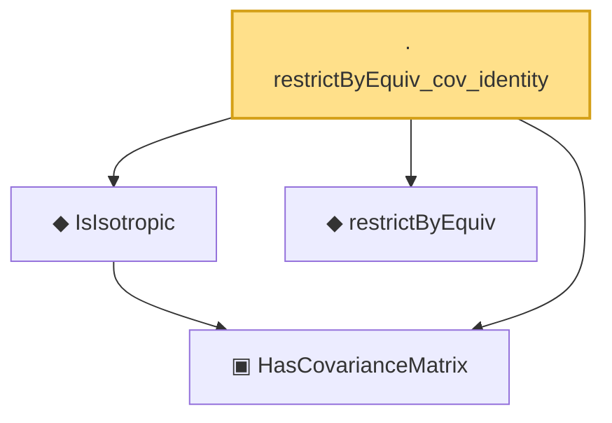

# Proof narrative — restrictByEquiv_cov_identity

Root: **restrictByEquiv_cov_identity** (lemma) `Statlib/HighDim/Geometry/RIPConstruction.lean:349` · topic `HighDim`
Closure: 4 declarations across 3 files. Generated from `proof_graph.json` — no files were moved.

Reading order (foundations first, headline last):

  ▣ `HasCovarianceMatrix` — structure · `Statlib/HighDim/Vocabulary/RandomVector.lean:101`  _(also used by 14: secondMoment_isSymm, secondMoment_posSemidef, secondMoment_eq_cov_centered, …)_
  ◆ `IsIsotropic` — def · `Statlib/HighDim/Vocabulary/RandomVector.lean:109`  _(also used by 7: quadratic_form_mean_isotropic, hanson_wright_isotropic, subgaussian_norm_sq_subexponential, …)_
  ◆ `restrictByEquiv` — def · `Statlib/HighDim/Vocabulary/Restrictions.lean:15`  _(also used by 10: measurable_restrictByEquiv, restrictByEquiv_hasMean_zero, extendByEquiv_restrictByEquiv_of_support, …)_
· `restrictByEquiv_cov_identity` — lemma · `Statlib/HighDim/Geometry/RIPConstruction.lean:349` **← headline**

## Dependency diagram

