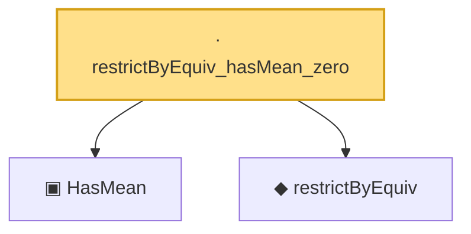

# Proof narrative — restrictByEquiv_hasMean_zero

Root: **restrictByEquiv_hasMean_zero** (lemma) `Statlib/HighDim/Geometry/RIPConstruction.lean:339` · topic `HighDim`
Closure: 3 declarations across 3 files. Generated from `proof_graph.json` — no files were moved.

Reading order (foundations first, headline last):

  ▣ `HasMean` — structure · `Statlib/HighDim/Vocabulary/RandomVector.lean:83`  _(also used by 60: coord_mul_integral_eq_zero_of_indep, offDiagQuadForm_integral_eq_zero_of_indep, offDiagQuadForm_centered_eq_self_of_indep, …)_
  ◆ `restrictByEquiv` — def · `Statlib/HighDim/Vocabulary/Restrictions.lean:15`  _(also used by 10: measurable_restrictByEquiv, restrictByEquiv_cov_identity, extendByEquiv_restrictByEquiv_of_support, …)_
· `restrictByEquiv_hasMean_zero` — lemma · `Statlib/HighDim/Geometry/RIPConstruction.lean:339` **← headline**

## Dependency diagram

