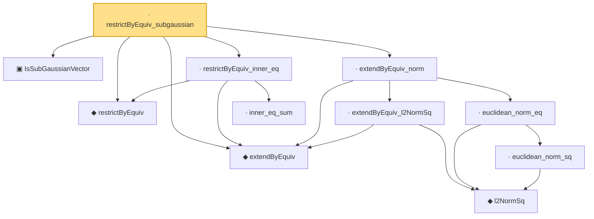

# Proof narrative — restrictByEquiv_subgaussian

Root: **restrictByEquiv_subgaussian** (lemma) `Statlib/HighDim/Geometry/RIPConstruction.lean:453` · topic `HighDim`
Closure: 11 declarations across 4 files. Generated from `proof_graph.json` — no files were moved.

Reading order (foundations first, headline last):

  ▣ `IsSubGaussianVector` — structure · `Statlib/HighDim/Vocabulary/RandomVector.lean:52`  _(also used by 78: decoupledOffDiagQuadForm_const_right_subgaussian, decoupledOffDiagQuadForm_const_right_abs_tail_real, decoupledOffDiagQuadForm_prod_first_section_abs_tail_real, …)_
  ◆ `restrictByEquiv` — def · `Statlib/HighDim/Vocabulary/Restrictions.lean:15`  _(also used by 9: measurable_restrictByEquiv, restrictByEquiv_hasMean_zero, restrictByEquiv_cov_identity, …)_
  ◆ `extendByEquiv` — def · `Statlib/HighDim/Vocabulary/Restrictions.lean:20`  _(also used by 4: extendByEquiv_restrictByEquiv_of_support, restrictByEquiv_extendByEquiv, restricted_sample_deviation_quadratic, …)_
      ◆ `l2NormSq` — noncomputable def · `Statlib/HighDim/Vocabulary/Norms.lean:13`  _(also used by 54: matrixRowVec_norm_sq, offDiagCoeffVec_norm_sq_le_frobenius, offDiagCoeffVec_norm_sq_integral_le_frobenius, …)_
      · `euclidean_norm_sq` — lemma · `Statlib/HighDim/Vocabulary/Norms.lean:21`  _(also used by 14: matrixRowVec_norm_sq, offDiagCoeffVec_norm_sq_le_frobenius, offDiagCoeffVec_norm_sq_integral_le_frobenius, …)_
    · `euclidean_norm_eq` — lemma · `Statlib/HighDim/Vocabulary/Norms.lean:27`  _(also used by 2: covering_number_sparse_ball, log_covering_number_sparse)_
    · `extendByEquiv_l2NormSq` — lemma · `Statlib/HighDim/Geometry/RIPConstruction.lean:349`
  · `extendByEquiv_norm` — lemma · `Statlib/HighDim/Geometry/RIPConstruction.lean:379`  _(also used by 2: restrictByEquiv_norm_of_support, subgaussian_rip_tail)_
    · `inner_eq_sum` — lemma · `Statlib/HighDim/Vocabulary/Norms.lean:32`  _(also used by 15: decoupledOffDiagQuadForm_eq_inner_coeff, offDiagCoeffVec_apply_eq_inner_row_zeroDiag, subgaussian_vector_coord, …)_
  · `restrictByEquiv_inner_eq` — lemma · `Statlib/HighDim/Geometry/RIPConstruction.lean:423`  _(also used by 1: restricted_sample_deviation_quadratic)_
· `restrictByEquiv_subgaussian` — lemma · `Statlib/HighDim/Geometry/RIPConstruction.lean:453` **← headline**

## Dependency diagram

