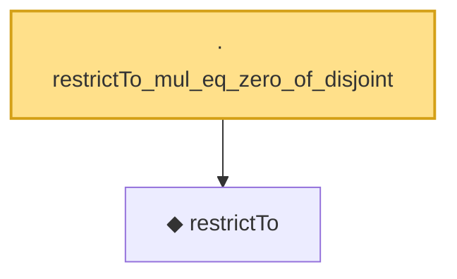

# Proof narrative — restrictTo_mul_eq_zero_of_disjoint

Root: **restrictTo_mul_eq_zero_of_disjoint** (lemma) `Statlib/HighDim/Geometry/RIPConstruction.lean:155` · topic `HighDim`
Closure: 2 declarations across 2 files. Generated from `proof_graph.json` — no files were moved.

Reading order (foundations first, headline last):

  ◆ `restrictTo` — def · `Statlib/HighDim/Vocabulary/Restrictions.lean:11`  _(also used by 4: restrictTo_sparse, restrictTo_l2NormSq, rip_lower_restrictTo, …)_
· `restrictTo_mul_eq_zero_of_disjoint` — lemma · `Statlib/HighDim/Geometry/RIPConstruction.lean:155` **← headline**

## Dependency diagram

