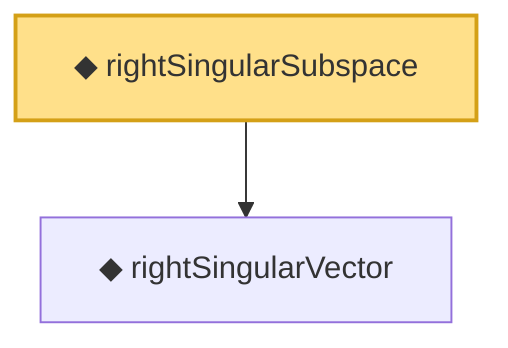

# Proof narrative — rightSingularSubspace

Root: **rightSingularSubspace** (def) `Statlib/HighDim/Vocabulary/SVD.lean:83` · topic `HighDim`
Closure: 2 declarations across 1 files. Generated from `proof_graph.json` — no files were moved.

Reading order (foundations first, headline last):

  ◆ `rightSingularVector` — noncomputable def · `Statlib/HighDim/Vocabulary/SVD.lean:71`
◆ `rightSingularSubspace` — def · `Statlib/HighDim/Vocabulary/SVD.lean:83` **← headline**

## Dependency diagram

