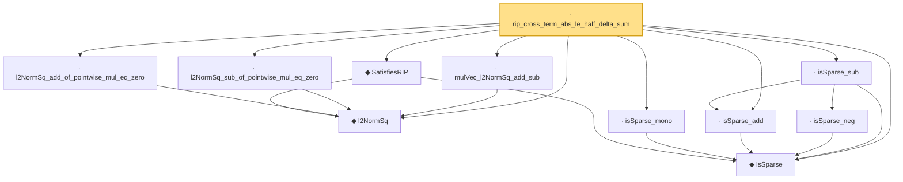

# Proof narrative — rip_cross_term_abs_le_half_delta_sum

Root: **rip_cross_term_abs_le_half_delta_sum** (lemma) `Statlib/HighDim/Geometry/RIPConstruction.lean:242` · topic `HighDim`
Closure: 11 declarations across 4 files. Generated from `proof_graph.json` — no files were moved.

Reading order (foundations first, headline last):

  ◆ `IsSparse` — def · `Statlib/HighDim/Vocabulary/Sparse.lean:36`  _(also used by 8: covering_number_sparse_ball, log_covering_number_sparse, exists_support_card_eq_of_isSparse, …)_
  ◆ `l2NormSq` — noncomputable def · `Statlib/HighDim/Vocabulary/Norms.lean:13`  _(also used by 29: matrixRowVec_norm_sq, offDiagCoeffVec_norm_sq_le_frobenius, offDiagCoeffVec_norm_sq_integral_le_frobenius, …)_
  ◆ `SatisfiesRIP` — def · `Statlib/HighDim/Vocabulary/DesignMatrix.lean:62`  _(also used by 5: rip_lower_restrictTo, rip_upper_restrictTo, subgaussian_rip_tail, …)_
  · `isSparse_mono` — lemma · `Statlib/HighDim/Geometry/RIPConstruction.lean:85`
  · `isSparse_add` — lemma · `Statlib/HighDim/Geometry/RIPConstruction.lean:97`
    · `isSparse_neg` — lemma · `Statlib/HighDim/Geometry/RIPConstruction.lean:90`
  · `isSparse_sub` — lemma · `Statlib/HighDim/Geometry/RIPConstruction.lean:115`
  · `l2NormSq_add_of_pointwise_mul_eq_zero` — lemma · `Statlib/HighDim/Geometry/RIPConstruction.lean:189`
  · `l2NormSq_sub_of_pointwise_mul_eq_zero` — lemma · `Statlib/HighDim/Geometry/RIPConstruction.lean:199`
  · `mulVec_l2NormSq_add_sub` — lemma · `Statlib/HighDim/Geometry/RIPConstruction.lean:223`
· `rip_cross_term_abs_le_half_delta_sum` — lemma · `Statlib/HighDim/Geometry/RIPConstruction.lean:242` **← headline**

## Dependency diagram

