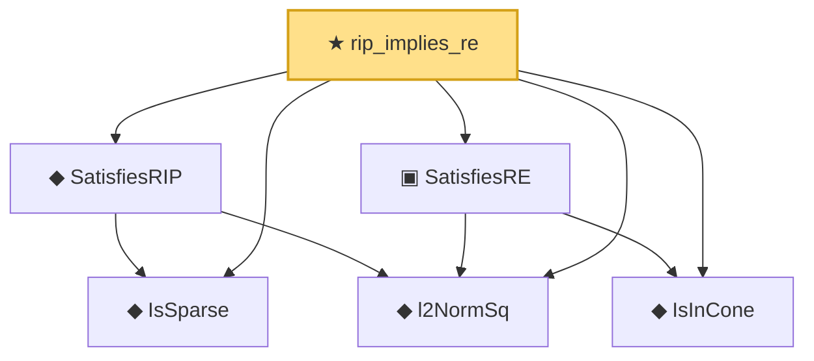

# Proof narrative — rip_implies_re

Root: **rip_implies_re** (theorem) `Statlib/HighDim/Geometry/RIPConstruction.lean:1659` · topic `HighDim`
Closure: 6 declarations across 4 files. Generated from `proof_graph.json` — no files were moved.

Reading order (foundations first, headline last):

  ◆ `IsSparse` — def · `Statlib/HighDim/Vocabulary/Sparse.lean:36`  _(also used by 12: covering_number_sparse_ball, log_covering_number_sparse, isSparse_mono, …)_
  ◆ `l2NormSq` — noncomputable def · `Statlib/HighDim/Vocabulary/Norms.lean:13`  _(also used by 31: matrixRowVec_norm_sq, offDiagCoeffVec_norm_sq_le_frobenius, offDiagCoeffVec_norm_sq_integral_le_frobenius, …)_
  ◆ `SatisfiesRIP` — def · `Statlib/HighDim/Vocabulary/DesignMatrix.lean:62`  _(also used by 5: rip_cross_term_abs_le_half_delta_sum, rip_lower_restrictTo, rip_upper_restrictTo, …)_
  ◆ `IsInCone` — def · `Statlib/HighDim/Vocabulary/Sparse.lean:49`  _(also used by 4: lasso_cone_condition, lasso_oracle_prediction, lasso_oracle_l1, …)_
  ▣ `SatisfiesRE` — structure · `Statlib/HighDim/Vocabulary/DesignMatrix.lean:42`  _(also used by 3: lasso_oracle_prediction, lasso_oracle_l1, lasso_oracle_l2)_
★ `rip_implies_re` — theorem · `Statlib/HighDim/Geometry/RIPConstruction.lean:1659` **← headline**

## Dependency diagram

