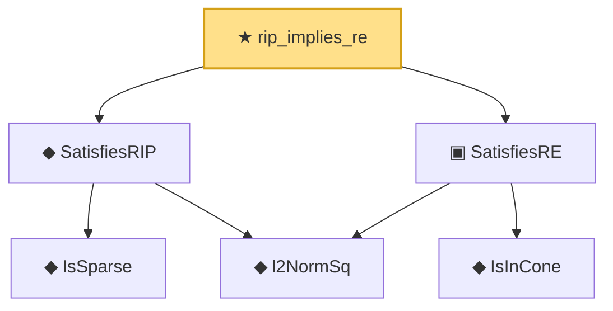

# Proof narrative — rip_implies_re

Root: **rip_implies_re** (theorem) `Statlib/HighDim/RIPConstruction.lean:91` · topic `HighDim`
Closure: 6 declarations across 4 files. Generated from `proof_graph.json` — no files were moved.

Reading order (foundations first, headline last):

    ◆ `IsSparse` — def · `Statlib/Vocabulary/Sparse.lean:36`  _(also used by 2: covering_number_sparse_ball, log_covering_number_sparse)_
    ◆ `l2NormSq` — def · `Statlib/Regression/l2NormSq.lean:14`  _(also used by 7: IsRidgeEstimator.shrinkage_bound, elasticNetLoss, elasticNetLoss_nonneg, …)_
  ◆ `SatisfiesRIP` — def · `Statlib/Vocabulary/DesignMatrix.lean:63`  _(also used by 2: subgaussian_rip_tail, subgaussian_rip_sample_complexity)_
    ◆ `IsInCone` — def · `Statlib/Vocabulary/Sparse.lean:49`  _(also used by 1: lasso_cone_condition)_
  ▣ `SatisfiesRE` — structure · `Statlib/Vocabulary/DesignMatrix.lean:43`  _(also used by 3: lasso_oracle_prediction, lasso_oracle_l1, lasso_oracle_l2)_
★ `rip_implies_re` — theorem · `Statlib/HighDim/RIPConstruction.lean:91` **← headline**

## Dependency diagram

