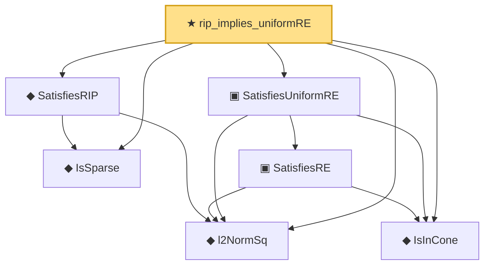

# Proof narrative — rip_implies_uniformRE

Root: **rip_implies_uniformRE** (theorem) `Statlib/HighDim/Geometry/RIPConstruction.lean:1668` · topic `HighDim`
Closure: 7 declarations across 4 files. Generated from `proof_graph.json` — no files were moved.

Reading order (foundations first, headline last):

  ◆ `IsSparse` — def · `Statlib/HighDim/Vocabulary/Sparse.lean:36`  _(also used by 48: threshold_head_quadratic_remainder_abs_from_bilinear_l2_tail, subgaussian_l1_shell_localized_centered_tail_from_sparse_approximation_cover, subgaussian_l1_shell_localized_centered_tail_from_sparse_ball_approximation_cover, …)_
  ◆ `l2NormSq` — noncomputable def · `Statlib/HighDim/Vocabulary/Norms.lean:13`  _(also used by 218: matrixRowVec_norm_sq, offDiagCoeffVec_norm_sq_le_frobenius, offDiagCoeffVec_norm_sq_integral_le_frobenius, …)_
  ◆ `SatisfiesRIP` — def · `Statlib/HighDim/Vocabulary/DesignMatrix.lean:260`  _(also used by 5: rip_cross_term_abs_le_half_delta_sum, rip_lower_restrictTo, rip_upper_restrictTo, …)_
  ◆ `IsInCone` — def · `Statlib/HighDim/Vocabulary/Sparse.lean:49`  _(also used by 11: lasso_cone_condition, lasso_oracle_prediction_of_supportRE, lasso_oracle_l1_of_supportRE, …)_
    ▣ `SatisfiesRE` — structure · `Statlib/HighDim/Vocabulary/DesignMatrix.lean:84`  _(also used by 8: lasso_oracle_prediction, lasso_oracle_l1, lasso_oracle_support_l2, …)_
  ▣ `SatisfiesUniformRE` — structure · `Statlib/HighDim/Vocabulary/DesignMatrix.lean:118`  _(also used by 10: lasso_oracle_prediction_of_uniformRE, lasso_oracle_l1_of_uniformRE, lasso_oracle_support_l2_of_uniformRE, …)_
★ `rip_implies_uniformRE` — theorem · `Statlib/HighDim/Geometry/RIPConstruction.lean:1668` **← headline**

## Dependency diagram

