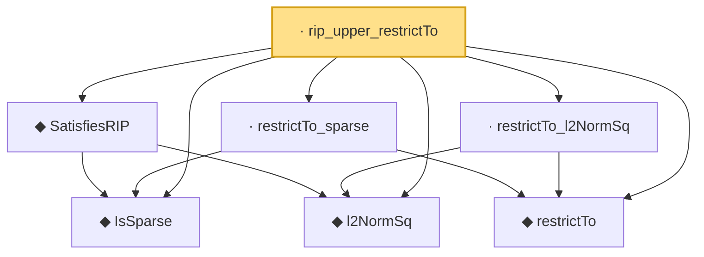

# Proof narrative — rip_upper_restrictTo

Root: **rip_upper_restrictTo** (lemma) `Statlib/HighDim/Geometry/RIPConstruction.lean:324` · topic `HighDim`
Closure: 7 declarations across 5 files. Generated from `proof_graph.json` — no files were moved.

Reading order (foundations first, headline last):

  ◆ `IsSparse` — def · `Statlib/HighDim/Vocabulary/Sparse.lean:36`  _(also used by 11: covering_number_sparse_ball, log_covering_number_sparse, isSparse_mono, …)_
  ◆ `l2NormSq` — noncomputable def · `Statlib/HighDim/Vocabulary/Norms.lean:13`  _(also used by 31: matrixRowVec_norm_sq, offDiagCoeffVec_norm_sq_le_frobenius, offDiagCoeffVec_norm_sq_integral_le_frobenius, …)_
  ◆ `SatisfiesRIP` — def · `Statlib/HighDim/Vocabulary/DesignMatrix.lean:62`  _(also used by 5: rip_cross_term_abs_le_half_delta_sum, rip_lower_restrictTo, subgaussian_rip_tail, …)_
  ◆ `restrictTo` — def · `Statlib/HighDim/Vocabulary/Restrictions.lean:11`  _(also used by 2: restrictTo_mul_eq_zero_of_disjoint, rip_lower_restrictTo)_
  · `restrictTo_sparse` — lemma · `Statlib/HighDim/Geometry/RIPConstruction.lean:154`  _(also used by 1: rip_lower_restrictTo)_
  · `restrictTo_l2NormSq` — lemma · `Statlib/HighDim/Geometry/RIPConstruction.lean:160`  _(also used by 1: rip_lower_restrictTo)_
· `rip_upper_restrictTo` — lemma · `Statlib/HighDim/Geometry/RIPConstruction.lean:324` **← headline**

## Dependency diagram

