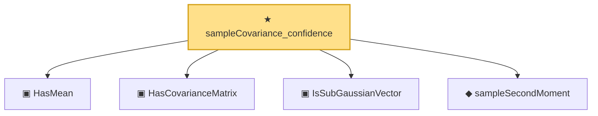

# Proof narrative — sampleCovariance_confidence

Root: **sampleCovariance_confidence** (theorem) `Statlib/HighDim/SampleCovariance.lean:92` · topic `HighDim`
Closure: 5 declarations across 2 files. Generated from `proof_graph.json` — no files were moved.

Reading order (foundations first, headline last):

  ▣ `HasMean` — structure · `Statlib/Vocabulary/RandomVector.lean:83`  _(also used by 10: hanson_wright, hanson_wright_isotropic, secondMoment_eq_cov_centered, …)_
  ▣ `HasCovarianceMatrix` — structure · `Statlib/Vocabulary/RandomVector.lean:101`  _(also used by 8: secondMoment_isSymm, secondMoment_posSemidef, secondMoment_eq_cov_centered, …)_
  ▣ `IsSubGaussianVector` — structure · `Statlib/Vocabulary/RandomVector.lean:52`  _(also used by 11: hanson_wright, hanson_wright_isotropic, subgaussian_variance_bound, …)_
  ◆ `sampleSecondMoment` — noncomputable def · `Statlib/HighDim/SampleCovariance.lean:41`  _(also used by 3: sampleSecondMoment_unbiased, sampleCovariance_concentration, pca_eigvec_perturbation)_
★ `sampleCovariance_confidence` — theorem · `Statlib/HighDim/SampleCovariance.lean:92` **← headline**

## Dependency diagram

