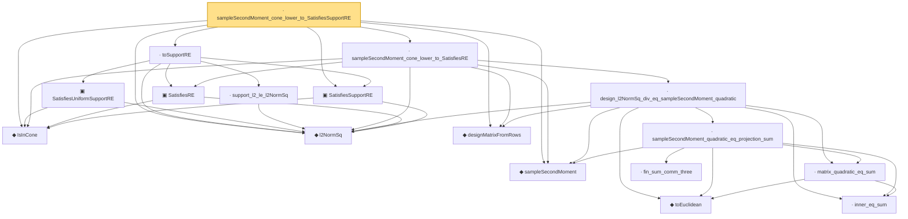

# Proof narrative — sampleSecondMoment_cone_lower_to_SatisfiesSupportRE

Root: **sampleSecondMoment_cone_lower_to_SatisfiesSupportRE** (lemma) `Statlib/HighDim/Regression/SampleCovarianceDesignBridge.lean:256` · topic `HighDim`
Closure: 17 declarations across 5 files. Generated from `proof_graph.json` — no files were moved.

Reading order (foundations first, headline last):

  ◆ `IsInCone` — def · `Statlib/HighDim/Vocabulary/Sparse.lean:49`  _(also used by 9: rip_implies_uniformRE, lasso_cone_condition, lasso_oracle_prediction_of_supportRE, …)_
  ◆ `l2NormSq` — noncomputable def · `Statlib/HighDim/Vocabulary/Norms.lean:13`  _(also used by 214: matrixRowVec_norm_sq, offDiagCoeffVec_norm_sq_le_frobenius, offDiagCoeffVec_norm_sq_integral_le_frobenius, …)_
  ◆ `sampleSecondMoment` — noncomputable def · `Statlib/HighDim/CovarianceMatrix/SampleCovariance.lean:199`  _(also used by 53: finite_l1_quadratic_rademacher_sample_envelope_entrywise_good_bound, sample_covariance_entry_centered_representation, sample_covariance_entry_bad_event_eq_centered_product_event, …)_
  ▣ `SatisfiesSupportRE` — structure · `Statlib/HighDim/Vocabulary/DesignMatrix.lean:69`  _(also used by 4: lasso_oracle_prediction_of_supportRE, lasso_oracle_l1_of_supportRE, lasso_oracle_support_l2_of_supportRE, …)_
  ◆ `designMatrixFromRows` — noncomputable def · `Statlib/HighDim/Regression/SampleCovarianceDesignBridge.lean:25`  _(also used by 5: normalized_nonzero_design_covariance_quadratic, sampleSecondMoment_lower_to_SatisfiesUniformRE, sampleSecondMoment_lower_to_SatisfiesUniformSupportRE, …)_
    ▣ `SatisfiesRE` — structure · `Statlib/HighDim/Vocabulary/DesignMatrix.lean:84`  _(also used by 7: lasso_oracle_prediction, lasso_oracle_l1, lasso_oracle_support_l2, …)_
      ◆ `toEuclidean` — noncomputable def · `Statlib/HighDim/Vocabulary/Norms.lean:109`  _(also used by 17: sampleSecondMoment_quadratic_eq_l2NormSq_div, sampleSecondMoment_unit_direction_lower_tail_double_sum, hermitian_norm_le_two_net_sup, …)_
      · `inner_eq_sum` — lemma · `Statlib/HighDim/Vocabulary/Norms.lean:100`  _(also used by 18: decoupledOffDiagQuadForm_eq_inner_coeff, offDiagCoeffVec_apply_eq_inner_row_zeroDiag, subgaussian_vector_coord, …)_
      · `matrix_quadratic_eq_sum` — lemma · `Statlib/HighDim/CovarianceMatrix/SampleCovariance.lean:342`  _(also used by 4: sampleSecondMoment_quadratic_eq_l2NormSq_div, sampleSecondMoment_unit_direction_lower_tail_double_sum, sample_covariance_quadratic_eq_centered_projection_sum, …)_
        · `fin_sum_comm_three` — lemma · `Statlib/HighDim/CovarianceMatrix/SampleCovariance.lean:354`
      · `sampleSecondMoment_quadratic_eq_projection_sum` — lemma · `Statlib/HighDim/CovarianceMatrix/SampleCovariance.lean:364`  _(also used by 4: sampleSecondMoment_quadratic_eq_l2NormSq_div, sampleSecondMoment_unit_direction_lower_tail_double_sum, sample_covariance_quadratic_eq_centered_projection_sum, …)_
    · `design_l2NormSq_div_eq_sampleSecondMoment_quadratic` — lemma · `Statlib/HighDim/Regression/SampleCovarianceDesignBridge.lean:171`  _(also used by 2: sampleSecondMoment_lower_to_SatisfiesUniformRE, sampleSecondMoment_upper_to_column_bound)_
  · `sampleSecondMoment_cone_lower_to_SatisfiesRE` — lemma · `Statlib/HighDim/Regression/SampleCovarianceDesignBridge.lean:235`
    · `support_l2_le_l2NormSq` — lemma · `Statlib/HighDim/Vocabulary/Sparse.lean:54`  _(also used by 2: toUniformSupportRE, l1RSE_to_uniformRE)_
    ▣ `SatisfiesUniformSupportRE` — structure · `Statlib/HighDim/Vocabulary/DesignMatrix.lean:101`  _(also used by 6: lasso_oracle_prediction_of_uniformSupportRE, lasso_oracle_l1_of_uniformSupportRE, lasso_oracle_support_l2_of_uniformSupportRE, …)_
  · `toSupportRE` — lemma · `Statlib/HighDim/Vocabulary/DesignMatrix.lean:129`  _(also used by 7: lasso_oracle_prediction_of_uniformSupportRE, lasso_oracle_prediction, lasso_oracle_l1_of_uniformSupportRE, …)_
· `sampleSecondMoment_cone_lower_to_SatisfiesSupportRE` — lemma · `Statlib/HighDim/Regression/SampleCovarianceDesignBridge.lean:256` **← headline**

## Dependency diagram

```mermaid
flowchart TD
  n0["◆ IsInCone"]
  n1["◆ l2NormSq"]
  n2["◆ sampleSecondMoment"]
  n3["▣ SatisfiesSupportRE"]
  n4["◆ designMatrixFromRows"]
  n5["▣ SatisfiesRE"]
  n6["◆ toEuclidean"]
  n7["· inner_eq_sum"]
  n8["· matrix_quadratic_eq_sum"]
  n9["· fin_sum_comm_three"]
  n10["· sampleSecondMoment_quadratic_eq_projection_sum"]
  n11["· design_l2NormSq_div_eq_sampleSecondMoment_quadratic"]
  n12["· sampleSecondMoment_cone_lower_to_SatisfiesRE"]
  n13["· support_l2_le_l2NormSq"]
  n14["▣ SatisfiesUniformSupportRE"]
  n15["· toSupportRE"]
  n16["· sampleSecondMoment_cone_lower_to_SatisfiesSupportRE"]
  n3 --> n0
  n3 --> n1
  n5 --> n0
  n5 --> n1
  n8 --> n6
  n8 --> n7
  n10 --> n6
  n10 --> n2
  n10 --> n8
  n10 --> n9
  n10 --> n7
  n11 --> n1
  n11 --> n4
  n11 --> n2
  n11 --> n10
  n11 --> n6
  n11 --> n8
  n11 --> n7
  n12 --> n0
  n12 --> n1
  n12 --> n2
  n12 --> n5
  n12 --> n4
  n12 --> n11
  n13 --> n1
  n14 --> n0
  n14 --> n1
  n15 --> n5
  n15 --> n3
  n15 --> n13
  n15 --> n1
  n15 --> n14
  n16 --> n0
  n16 --> n1
  n16 --> n2
  n16 --> n3
  n16 --> n4
  n16 --> n12
  n16 --> n15
  class n16 headline;
  classDef headline fill:#ffe08a,stroke:#d4a017,stroke-width:2px;
  classDef axiomNode fill:#ffd0d0,stroke:#c0392b,stroke-dasharray:4 2;
```
