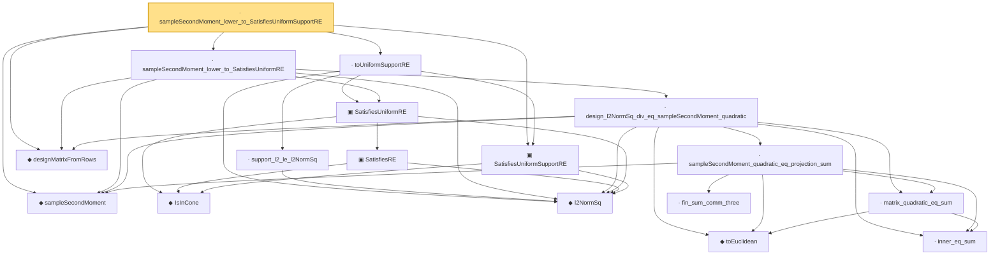

# Proof narrative — sampleSecondMoment_lower_to_SatisfiesUniformSupportRE

Root: **sampleSecondMoment_lower_to_SatisfiesUniformSupportRE** (lemma) `Statlib/HighDim/Regression/SampleCovarianceDesignBridge.lean:81` · topic `HighDim`
Closure: 17 declarations across 5 files. Generated from `proof_graph.json` — no files were moved.

Reading order (foundations first, headline last):

  ◆ `sampleSecondMoment` — noncomputable def · `Statlib/HighDim/CovarianceMatrix/SampleCovariance.lean:199`  _(also used by 13: sample_cov_min_eig_lower, sample_cov_max_eig_upper, sampleSecondMoment_isSymm, …)_
    ◆ `IsInCone` — def · `Statlib/HighDim/Vocabulary/Sparse.lean:49`  _(also used by 11: rip_implies_uniformRE, lasso_cone_condition, lasso_oracle_prediction_of_supportRE, …)_
    ◆ `l2NormSq` — noncomputable def · `Statlib/HighDim/Vocabulary/Norms.lean:13`  _(also used by 50: matrixRowVec_norm_sq, offDiagCoeffVec_norm_sq_le_frobenius, offDiagCoeffVec_norm_sq_integral_le_frobenius, …)_
  ▣ `SatisfiesUniformSupportRE` — structure · `Statlib/HighDim/Vocabulary/DesignMatrix.lean:82`  _(also used by 4: lasso_oracle_prediction_of_uniformSupportRE, lasso_oracle_l1_of_uniformSupportRE, lasso_oracle_support_l2_of_uniformSupportRE, …)_
  ◆ `designMatrixFromRows` — noncomputable def · `Statlib/HighDim/Regression/SampleCovarianceDesignBridge.lean:24`  _(also used by 4: sampleSecondMoment_cone_lower_to_SatisfiesRE, sampleSecondMoment_cone_lower_to_SatisfiesSupportRE, design_l2NormSq_basis_eq_column_sum, …)_
      ▣ `SatisfiesRE` — structure · `Statlib/HighDim/Vocabulary/DesignMatrix.lean:65`  _(also used by 8: lasso_oracle_prediction, lasso_oracle_l1, lasso_oracle_support_l2, …)_
    ▣ `SatisfiesUniformRE` — structure · `Statlib/HighDim/Vocabulary/DesignMatrix.lean:99`  _(also used by 9: rip_implies_uniformRE, lasso_oracle_prediction_of_uniformRE, lasso_oracle_l1_of_uniformRE, …)_
      ◆ `toEuclidean` — noncomputable def · `Statlib/HighDim/Vocabulary/Norms.lean:41`  _(also used by 7: hermitian_norm_le_two_net_sup, sample_covariance_quadratic_eq_centered_projection_sum, sampleCovariance_concentration, …)_
      · `inner_eq_sum` — lemma · `Statlib/HighDim/Vocabulary/Norms.lean:32`  _(also used by 13: decoupledOffDiagQuadForm_eq_inner_coeff, offDiagCoeffVec_apply_eq_inner_row_zeroDiag, subgaussian_vector_coord, …)_
      · `matrix_quadratic_eq_sum` — lemma · `Statlib/HighDim/CovarianceMatrix/SampleCovariance.lean:324`  _(also used by 2: sample_covariance_quadratic_eq_centered_projection_sum, restricted_sample_deviation_quadratic)_
        · `fin_sum_comm_three` — lemma · `Statlib/HighDim/CovarianceMatrix/SampleCovariance.lean:336`
      · `sampleSecondMoment_quadratic_eq_projection_sum` — lemma · `Statlib/HighDim/CovarianceMatrix/SampleCovariance.lean:346`  _(also used by 2: sample_covariance_quadratic_eq_centered_projection_sum, restricted_sample_deviation_quadratic)_
    · `design_l2NormSq_div_eq_sampleSecondMoment_quadratic` — lemma · `Statlib/HighDim/Regression/SampleCovarianceDesignBridge.lean:30`  _(also used by 2: sampleSecondMoment_cone_lower_to_SatisfiesRE, sampleSecondMoment_upper_to_column_bound)_
  · `sampleSecondMoment_lower_to_SatisfiesUniformRE` — lemma · `Statlib/HighDim/Regression/SampleCovarianceDesignBridge.lean:62`
    · `support_l2_le_l2NormSq` — lemma · `Statlib/HighDim/Vocabulary/Sparse.lean:54`  _(also used by 2: toSupportRE, l1RSE_to_uniformRE)_
  · `toUniformSupportRE` — lemma · `Statlib/HighDim/Vocabulary/DesignMatrix.lean:161`
· `sampleSecondMoment_lower_to_SatisfiesUniformSupportRE` — lemma · `Statlib/HighDim/Regression/SampleCovarianceDesignBridge.lean:81` **← headline**

## Dependency diagram

