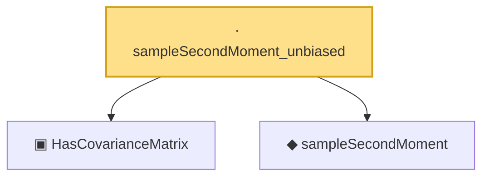

# Proof narrative — sampleSecondMoment_unbiased

Root: **sampleSecondMoment_unbiased** (lemma) `Statlib/HighDim/CovarianceMatrix/SampleCovariance.lean:485` · topic `HighDim`
Closure: 3 declarations across 2 files. Generated from `proof_graph.json` — no files were moved.

Reading order (foundations first, headline last):

  ▣ `HasCovarianceMatrix` — structure · `Statlib/HighDim/Vocabulary/RandomVector.lean:101`  _(also used by 15: secondMoment_isSymm, secondMoment_posSemidef, secondMoment_eq_cov_centered, …)_
  ◆ `sampleSecondMoment` — noncomputable def · `Statlib/HighDim/CovarianceMatrix/SampleCovariance.lean:190`  _(also used by 8: sampleSecondMoment_isSymm, sampleSecondMoment_quadratic_eq_projection_sum, sample_covariance_quadratic_eq_centered_projection_sum, …)_
· `sampleSecondMoment_unbiased` — lemma · `Statlib/HighDim/CovarianceMatrix/SampleCovariance.lean:485` **← headline**

## Dependency diagram

