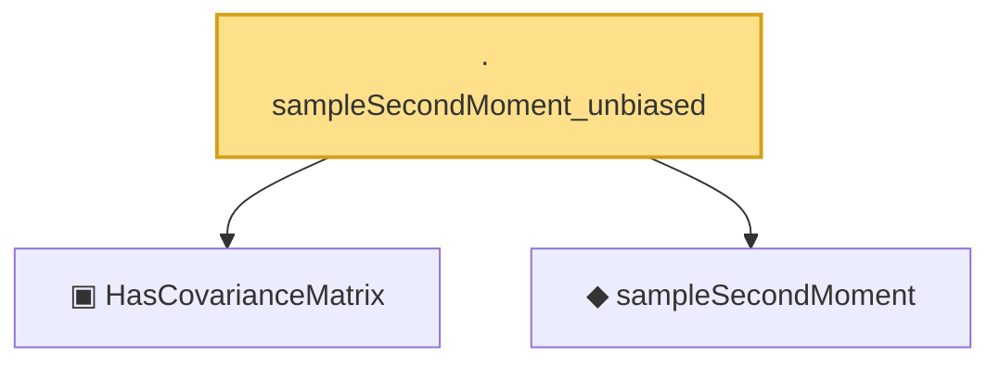

# Proof narrative — sampleSecondMoment_unbiased

Root: **sampleSecondMoment_unbiased** (lemma) `Statlib/HighDim/CovarianceMatrix/SampleCovariance.lean:425` · topic `HighDim`
Closure: 3 declarations across 2 files. Generated from `proof_graph.json` — no files were moved.

Reading order (foundations first, headline last):

  ▣ `HasCovarianceMatrix` — structure · `Statlib/HighDim/Vocabulary/RandomVector.lean:101`  _(also used by 117: cov_diagonal_concentration, cov_quadratic_deviation, cov_quadratic_deviation_uniform_const, …)_
  ◆ `sampleSecondMoment` — noncomputable def · `Statlib/HighDim/CovarianceMatrix/SampleCovariance.lean:199`  _(also used by 56: finite_l1_quadratic_rademacher_sample_envelope_entrywise_good_bound, sample_covariance_entry_centered_representation, sample_covariance_entry_bad_event_eq_centered_product_event, …)_
· `sampleSecondMoment_unbiased` — lemma · `Statlib/HighDim/CovarianceMatrix/SampleCovariance.lean:425` **← headline**

## Dependency diagram

```mermaid
flowchart TD
  n0["▣ HasCovarianceMatrix"]
  n1["◆ sampleSecondMoment"]
  n2["· sampleSecondMoment_unbiased"]
  n2 --> n0
  n2 --> n1
  class n2 headline;
  classDef headline fill:#ffe08a,stroke:#d4a017,stroke-width:2px;
  classDef axiomNode fill:#ffd0d0,stroke:#c0392b,stroke-dasharray:4 2;
```
