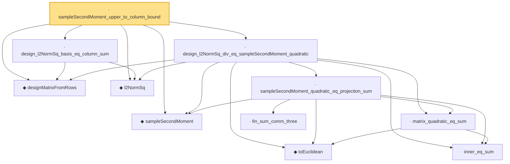

# Proof narrative — sampleSecondMoment_upper_to_column_bound

Root: **sampleSecondMoment_upper_to_column_bound** (lemma) `Statlib/HighDim/Regression/SampleCovarianceDesignBridge.lean:137` · topic `HighDim`
Closure: 11 declarations across 3 files. Generated from `proof_graph.json` — no files were moved.

Reading order (foundations first, headline last):

  ◆ `sampleSecondMoment` — noncomputable def · `Statlib/HighDim/CovarianceMatrix/SampleCovariance.lean:199`  _(also used by 14: sample_cov_min_eig_lower, sample_cov_max_eig_upper, sampleSecondMoment_isSymm, …)_
  ◆ `designMatrixFromRows` — noncomputable def · `Statlib/HighDim/Regression/SampleCovarianceDesignBridge.lean:24`  _(also used by 4: sampleSecondMoment_lower_to_SatisfiesUniformRE, sampleSecondMoment_lower_to_SatisfiesUniformSupportRE, sampleSecondMoment_cone_lower_to_SatisfiesRE, …)_
  ◆ `l2NormSq` — noncomputable def · `Statlib/HighDim/Vocabulary/Norms.lean:13`  _(also used by 54: matrixRowVec_norm_sq, offDiagCoeffVec_norm_sq_le_frobenius, offDiagCoeffVec_norm_sq_integral_le_frobenius, …)_
    ◆ `toEuclidean` — noncomputable def · `Statlib/HighDim/Vocabulary/Norms.lean:41`  _(also used by 7: hermitian_norm_le_two_net_sup, sample_covariance_quadratic_eq_centered_projection_sum, sampleCovariance_concentration, …)_
    · `inner_eq_sum` — lemma · `Statlib/HighDim/Vocabulary/Norms.lean:32`  _(also used by 13: decoupledOffDiagQuadForm_eq_inner_coeff, offDiagCoeffVec_apply_eq_inner_row_zeroDiag, subgaussian_vector_coord, …)_
    · `matrix_quadratic_eq_sum` — lemma · `Statlib/HighDim/CovarianceMatrix/SampleCovariance.lean:324`  _(also used by 2: sample_covariance_quadratic_eq_centered_projection_sum, restricted_sample_deviation_quadratic)_
      · `fin_sum_comm_three` — lemma · `Statlib/HighDim/CovarianceMatrix/SampleCovariance.lean:336`
    · `sampleSecondMoment_quadratic_eq_projection_sum` — lemma · `Statlib/HighDim/CovarianceMatrix/SampleCovariance.lean:346`  _(also used by 2: sample_covariance_quadratic_eq_centered_projection_sum, restricted_sample_deviation_quadratic)_
  · `design_l2NormSq_div_eq_sampleSecondMoment_quadratic` — lemma · `Statlib/HighDim/Regression/SampleCovarianceDesignBridge.lean:30`  _(also used by 2: sampleSecondMoment_lower_to_SatisfiesUniformRE, sampleSecondMoment_cone_lower_to_SatisfiesRE)_
  · `design_l2NormSq_basis_eq_column_sum` — lemma · `Statlib/HighDim/Regression/SampleCovarianceDesignBridge.lean:127`
· `sampleSecondMoment_upper_to_column_bound` — lemma · `Statlib/HighDim/Regression/SampleCovarianceDesignBridge.lean:137` **← headline**

## Dependency diagram

