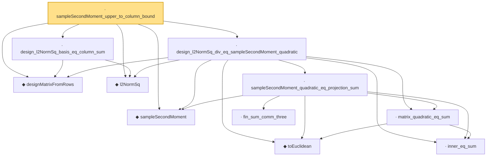

# Proof narrative — sampleSecondMoment_upper_to_column_bound

Root: **sampleSecondMoment_upper_to_column_bound** (lemma) `Statlib/HighDim/Regression/SampleCovarianceDesignBridge.lean:278` · topic `HighDim`
Closure: 11 declarations across 3 files. Generated from `proof_graph.json` — no files were moved.

Reading order (foundations first, headline last):

  ◆ `sampleSecondMoment` — noncomputable def · `Statlib/HighDim/CovarianceMatrix/SampleCovariance.lean:199`  _(also used by 54: finite_l1_quadratic_rademacher_sample_envelope_entrywise_good_bound, sample_covariance_entry_centered_representation, sample_covariance_entry_bad_event_eq_centered_product_event, …)_
  ◆ `designMatrixFromRows` — noncomputable def · `Statlib/HighDim/Regression/SampleCovarianceDesignBridge.lean:25`  _(also used by 5: normalized_nonzero_design_covariance_quadratic, sampleSecondMoment_lower_to_SatisfiesUniformRE, sampleSecondMoment_lower_to_SatisfiesUniformSupportRE, …)_
  ◆ `l2NormSq` — noncomputable def · `Statlib/HighDim/Vocabulary/Norms.lean:13`  _(also used by 219: matrixRowVec_norm_sq, offDiagCoeffVec_norm_sq_le_frobenius, offDiagCoeffVec_norm_sq_integral_le_frobenius, …)_
    ◆ `toEuclidean` — noncomputable def · `Statlib/HighDim/Vocabulary/Norms.lean:109`  _(also used by 17: sampleSecondMoment_quadratic_eq_l2NormSq_div, sampleSecondMoment_unit_direction_lower_tail_double_sum, hermitian_norm_le_two_net_sup, …)_
    · `inner_eq_sum` — lemma · `Statlib/HighDim/Vocabulary/Norms.lean:100`  _(also used by 18: decoupledOffDiagQuadForm_eq_inner_coeff, offDiagCoeffVec_apply_eq_inner_row_zeroDiag, subgaussian_vector_coord, …)_
    · `matrix_quadratic_eq_sum` — lemma · `Statlib/HighDim/CovarianceMatrix/SampleCovariance.lean:342`  _(also used by 4: sampleSecondMoment_quadratic_eq_l2NormSq_div, sampleSecondMoment_unit_direction_lower_tail_double_sum, sample_covariance_quadratic_eq_centered_projection_sum, …)_
      · `fin_sum_comm_three` — lemma · `Statlib/HighDim/CovarianceMatrix/SampleCovariance.lean:354`
    · `sampleSecondMoment_quadratic_eq_projection_sum` — lemma · `Statlib/HighDim/CovarianceMatrix/SampleCovariance.lean:364`  _(also used by 4: sampleSecondMoment_quadratic_eq_l2NormSq_div, sampleSecondMoment_unit_direction_lower_tail_double_sum, sample_covariance_quadratic_eq_centered_projection_sum, …)_
  · `design_l2NormSq_div_eq_sampleSecondMoment_quadratic` — lemma · `Statlib/HighDim/Regression/SampleCovarianceDesignBridge.lean:171`  _(also used by 2: sampleSecondMoment_lower_to_SatisfiesUniformRE, sampleSecondMoment_cone_lower_to_SatisfiesRE)_
  · `design_l2NormSq_basis_eq_column_sum` — lemma · `Statlib/HighDim/Regression/SampleCovarianceDesignBridge.lean:268`
· `sampleSecondMoment_upper_to_column_bound` — lemma · `Statlib/HighDim/Regression/SampleCovarianceDesignBridge.lean:278` **← headline**

## Dependency diagram

```mermaid
flowchart TD
  n0["◆ sampleSecondMoment"]
  n1["◆ designMatrixFromRows"]
  n2["◆ l2NormSq"]
  n3["◆ toEuclidean"]
  n4["· inner_eq_sum"]
  n5["· matrix_quadratic_eq_sum"]
  n6["· fin_sum_comm_three"]
  n7["· sampleSecondMoment_quadratic_eq_projection_sum"]
  n8["· design_l2NormSq_div_eq_sampleSecondMoment_quadratic"]
  n9["· design_l2NormSq_basis_eq_column_sum"]
  n10["· sampleSecondMoment_upper_to_column_bound"]
  n5 --> n3
  n5 --> n4
  n7 --> n3
  n7 --> n0
  n7 --> n5
  n7 --> n6
  n7 --> n4
  n8 --> n2
  n8 --> n1
  n8 --> n0
  n8 --> n7
  n8 --> n3
  n8 --> n5
  n8 --> n4
  n9 --> n2
  n9 --> n1
  n10 --> n0
  n10 --> n1
  n10 --> n2
  n10 --> n8
  n10 --> n9
  class n10 headline;
  classDef headline fill:#ffe08a,stroke:#d4a017,stroke-width:2px;
  classDef axiomNode fill:#ffd0d0,stroke:#c0392b,stroke-dasharray:4 2;
```
