# Proof narrative — sample_cov_max_eig_upper

Root: **sample_cov_max_eig_upper** (theorem) `Statlib/HighDim/CovarianceMatrix/SampleCovEigenvalueUpper.lean:22` · topic `HighDim`
Closure: 33 declarations across 10 files. Generated from `proof_graph.json` — no files were moved.

Reading order (foundations first, headline last):

  ▣ `HasMean` — structure · `Statlib/HighDim/Vocabulary/RandomVector.lean:83`  _(also used by 34: coord_mul_integral_eq_zero_of_indep, offDiagQuadForm_integral_eq_zero_of_indep, offDiagQuadForm_centered_eq_self_of_indep, …)_
  ▣ `HasCovarianceMatrix` — structure · `Statlib/HighDim/Vocabulary/RandomVector.lean:101`  _(also used by 12: cov_quadratic_deviation, secondMoment_isSymm, secondMoment_posSemidef, …)_
  ▣ `IsSubGaussianVector` — structure · `Statlib/HighDim/Vocabulary/RandomVector.lean:52`  _(also used by 74: decoupledOffDiagQuadForm_const_right_subgaussian, decoupledOffDiagQuadForm_const_right_abs_tail_real, decoupledOffDiagQuadForm_prod_first_section_abs_tail_real, …)_
  ◆ `sampleSecondMoment` — noncomputable def · `Statlib/HighDim/CovarianceMatrix/SampleCovariance.lean:190`  _(also used by 5: sample_cov_min_eig_lower, sampleSecondMoment_unbiased, restricted_sample_deviation_quadratic, …)_
      · `covariance_isSymm_of_hasCovariance` — lemma · `Statlib/HighDim/CovarianceMatrix/SampleCovariance.lean:210`
      · `sampleSecondMoment_isSymm` — lemma · `Statlib/HighDim/CovarianceMatrix/SampleCovariance.lean:196`  _(also used by 2: subgaussian_rip_tail, pca_eigvec_perturbation)_
      · `real_isHermitian_of_isSymm` — lemma · `Statlib/HighDim/CovarianceMatrix/SampleCovariance.lean:178`  _(also used by 2: subgaussian_rip_tail, pca_eigvec_perturbation)_
      ◆ `toEuclidean` — noncomputable def · `Statlib/HighDim/Vocabulary/Norms.lean:41`  _(also used by 3: restricted_sample_deviation_quadratic, abs_quadratic_le_opNorm_mul_norm_sq, subgaussian_rip_tail)_
          · `hermitian_norm_eq_diagonal_eigenvalues` — lemma · `Statlib/HighDim/CovarianceMatrix/SampleCovariance.lean:38`
          · `pi_real_norm_eq_sup_abs` — lemma · `Statlib/HighDim/CovarianceMatrix/SampleCovariance.lean:58`
        · `hermitian_norm_eq_sup_abs_eigenvalues` — lemma · `Statlib/HighDim/CovarianceMatrix/SampleCovariance.lean:68`
      · `hermitian_norm_le_two_net_sup` — lemma · `Statlib/HighDim/CovarianceMatrix/SampleCovariance.lean:77`  _(also used by 1: subgaussian_rip_tail)_
        · `inner_eq_sum` — lemma · `Statlib/HighDim/Vocabulary/Norms.lean:32`  _(also used by 10: decoupledOffDiagQuadForm_eq_inner_coeff, offDiagCoeffVec_apply_eq_inner_row_zeroDiag, subgaussian_vector_coord, …)_
        · `matrix_quadratic_eq_sum` — lemma · `Statlib/HighDim/CovarianceMatrix/SampleCovariance.lean:315`  _(also used by 1: restricted_sample_deviation_quadratic)_
        · `projection_sq_integral_eq_cov_quadratic` — lemma · `Statlib/HighDim/CovarianceMatrix/SampleCovariance.lean:247`
          · `fin_sum_comm_three` — lemma · `Statlib/HighDim/CovarianceMatrix/SampleCovariance.lean:327`
        · `sampleSecondMoment_quadratic_eq_projection_sum` — lemma · `Statlib/HighDim/CovarianceMatrix/SampleCovariance.lean:337`  _(also used by 1: restricted_sample_deviation_quadratic)_
      · `sample_covariance_quadratic_eq_centered_projection_sum` — lemma · `Statlib/HighDim/CovarianceMatrix/SampleCovariance.lean:362`
      · `projection_measurable` — lemma · `Statlib/HighDim/CovarianceMatrix/SampleCovariance.lean:222`
      · `projection_sq_integrable` — lemma · `Statlib/HighDim/CovarianceMatrix/SampleCovariance.lean:296`
        · `scalar_sq_centered_exp_integrable` — lemma · `Statlib/HighDim/CovarianceMatrix/SampleCovariance.lean:393`
          · `sub_gauss_tail_abs` — lemma · `Statlib/StatFoundation/RandomVariable/SubExponential/subexp_mgf_le_of_sq_subgaussian.lean:13`  _(also used by 1: sub_gauss_tail_sq)_
          · `sq_le_two_mul_exp` — lemma · `Statlib/StatFoundation/RandomVariable/SubGaussian/sq_le_two_mul_exp.lean:10`
            ★ `subgaussian_meas_abs_ge_le_two_exp` — theorem · `Statlib/StatFoundation/RandomVariable/SubGaussian/subgaussian_meas_abs_ge_le_two_exp.lean:9`  _(also used by 3: subgaussian_linf_tail, lasso_noise_condition, subgaussian_even_moment_le)_
          ★ `subgaussian_exp_sq_le_at_one_third` — theorem · `Statlib/StatFoundation/RandomVariable/SubGaussian/subgaussian_exp_sq_le_at_one_third.lean:14`
          ★ `subgaussian_integrable_exp_sq_at_one_third` — theorem · `Statlib/StatFoundation/RandomVariable/SubGaussian/subgaussian_exp_sq_le_at_one_third.lean:165`  _(also used by 3: coord_mul_subexponential_exists_of_indep, coord_sq_centered_scaled_exp_integrable, coord_sq_centered_subexponential_exists)_
        ★ `subexp_mgf_le_of_sq_subgaussian_explicit` — theorem · `Statlib/StatFoundation/RandomVariable/SubExponential/subexp_mgf_le_of_sq_subgaussian.lean:72`  _(also used by 2: coord_sq_centered_mgf_bound_explicit, subexp_mgf_le_of_sq_subgaussian)_
      · `scalar_sq_centered_subexponential_explicit` — lemma · `Statlib/HighDim/CovarianceMatrix/SampleCovariance.lean:451`  _(also used by 3: cov_quadratic_deviation, jl_single_pair, subgaussian_rip_tail)_
        ▣ `HasSubexponentialMGF` — structure · `Statlib/StatFoundation/Vocabulary/RandomVariable.lean:74`  _(also used by 24: coord_mul_subexponential_exists_of_indep, subexponential_mgf_const_mul, subexponential_mgf_const_mul_relaxed, …)_
      ★ `bernstein_sum_meas_abs_ge_le_two_exp` — theorem · `Statlib/StatFoundation/Concentration/ExponentialType/bernstein_sum_meas_abs_ge_le_two_exp.lean:13`  _(also used by 4: weighted_coord_sq_centered_sum_tail_explicit, diag_hanson_wright_tail_high, jl_single_pair, …)_
    ★ `sampleCovariance_concentration` — theorem · `Statlib/HighDim/CovarianceMatrix/SampleCovariance.lean:529`
  ★ `sampleCovariance_confidence` — theorem · `Statlib/HighDim/CovarianceMatrix/SampleCovariance.lean:1314`  _(also used by 2: sample_cov_min_eig_lower, pca_eigvec_perturbation)_
★ `sample_cov_max_eig_upper` — theorem · `Statlib/HighDim/CovarianceMatrix/SampleCovEigenvalueUpper.lean:22` **← headline**

## Dependency diagram

```mermaid
flowchart TD
  n0["▣ HasMean"]
  n1["▣ HasCovarianceMatrix"]
  n2["▣ IsSubGaussianVector"]
  n3["◆ sampleSecondMoment"]
  n4["· covariance_isSymm_of_hasCovariance"]
  n5["· sampleSecondMoment_isSymm"]
  n6["· real_isHermitian_of_isSymm"]
  n7["◆ toEuclidean"]
  n8["· hermitian_norm_eq_diagonal_eigenvalues"]
  n9["· pi_real_norm_eq_sup_abs"]
  n10["· hermitian_norm_eq_sup_abs_eigenvalues"]
  n11["· hermitian_norm_le_two_net_sup"]
  n12["· inner_eq_sum"]
  n13["· matrix_quadratic_eq_sum"]
  n14["· projection_sq_integral_eq_cov_quadratic"]
  n15["· fin_sum_comm_three"]
  n16["· sampleSecondMoment_quadratic_eq_projection_sum"]
  n17["· sample_covariance_quadratic_eq_centered_projection_sum"]
  n18["· projection_measurable"]
  n19["· projection_sq_integrable"]
  n20["· scalar_sq_centered_exp_integrable"]
  n21["· sub_gauss_tail_abs"]
  n22["· sq_le_two_mul_exp"]
  n23["★ subgaussian_meas_abs_ge_le_two_exp"]
  n24["★ subgaussian_exp_sq_le_at_one_third"]
  n25["★ subgaussian_integrable_exp_sq_at_one_third"]
  n26["★ subexp_mgf_le_of_sq_subgaussian_explicit"]
  n27["· scalar_sq_centered_subexponential_explicit"]
  n28["▣ HasSubexponentialMGF"]
  n29["★ bernstein_sum_meas_abs_ge_le_two_exp"]
  n30["★ sampleCovariance_concentration"]
  n31["★ sampleCovariance_confidence"]
  n32["★ sample_cov_max_eig_upper"]
  n4 --> n1
  n5 --> n3
  n10 --> n8
  n10 --> n9
  n11 --> n7
  n11 --> n10
  n13 --> n7
  n13 --> n12
  n14 --> n1
  n14 --> n12
  n16 --> n7
  n16 --> n3
  n16 --> n13
  n16 --> n15
  n16 --> n12
  n17 --> n1
  n17 --> n7
  n17 --> n3
  n17 --> n13
  n17 --> n14
  n17 --> n16
  n19 --> n1
  n19 --> n12
  n24 --> n23
  n25 --> n23
  n26 --> n21
  n26 --> n22
  n26 --> n24
  n26 --> n25
  n27 --> n20
  n27 --> n26
  n29 --> n28
  n30 --> n0
  n30 --> n1
  n30 --> n2
  n30 --> n3
  n30 --> n4
  n30 --> n5
  n30 --> n6
  n30 --> n11
  n30 --> n7
  n30 --> n17
  n30 --> n18
  n30 --> n19
  n30 --> n27
  n30 --> n29
  n31 --> n0
  n31 --> n1
  n31 --> n2
  n31 --> n3
  n31 --> n30
  n32 --> n0
  n32 --> n1
  n32 --> n2
  n32 --> n3
  n32 --> n31
  class n32 headline;
  classDef headline fill:#ffe08a,stroke:#d4a017,stroke-width:2px;
  classDef axiomNode fill:#ffd0d0,stroke:#c0392b,stroke-dasharray:4 2;
```

