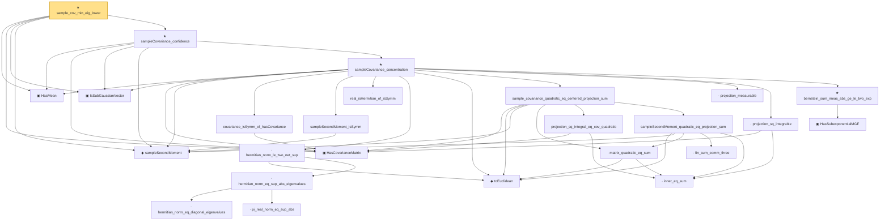

# Proof narrative — sample_cov_min_eig_lower

Root: **sample_cov_min_eig_lower** (theorem) `Statlib/HighDim/CovarianceMatrix/SampleCovEigenvalueLower.lean:21` · topic `HighDim`
Closure: 25 declarations across 6 files. Generated from `proof_graph.json` — no files were moved.

Reading order (foundations first, headline last):

  ▣ `HasMean` — structure · `Statlib/HighDim/Vocabulary/RandomVector.lean:83`  _(also used by 36: coord_mul_integral_eq_zero_of_indep, offDiagQuadForm_integral_eq_zero_of_indep, offDiagQuadForm_centered_eq_self_of_indep, …)_
  ▣ `HasCovarianceMatrix` — structure · `Statlib/HighDim/Vocabulary/RandomVector.lean:101`  _(also used by 15: cov_diagonal_concentration, cov_quadratic_deviation, cov_trace_concentration, …)_
  ▣ `IsSubGaussianVector` — structure · `Statlib/HighDim/Vocabulary/RandomVector.lean:52`  _(also used by 76: decoupledOffDiagQuadForm_const_right_subgaussian, decoupledOffDiagQuadForm_const_right_abs_tail_real, decoupledOffDiagQuadForm_prod_first_section_abs_tail_real, …)_
  ◆ `sampleSecondMoment` — noncomputable def · `Statlib/HighDim/CovarianceMatrix/SampleCovariance.lean:199`  _(also used by 11: sample_cov_max_eig_upper, sampleSecondMoment_unbiased, restricted_sample_deviation_quadratic, …)_
      · `covariance_isSymm_of_hasCovariance` — lemma · `Statlib/HighDim/CovarianceMatrix/SampleCovariance.lean:219`
      · `sampleSecondMoment_isSymm` — lemma · `Statlib/HighDim/CovarianceMatrix/SampleCovariance.lean:205`  _(also used by 2: subgaussian_rip_tail, pca_eigvec_perturbation)_
      · `real_isHermitian_of_isSymm` — lemma · `Statlib/HighDim/CovarianceMatrix/SampleCovariance.lean:187`  _(also used by 2: subgaussian_rip_tail, pca_eigvec_perturbation)_
      ◆ `toEuclidean` — noncomputable def · `Statlib/HighDim/Vocabulary/Norms.lean:41`  _(also used by 5: restricted_sample_deviation_quadratic, abs_quadratic_le_opNorm_mul_norm_sq, subgaussian_rip_tail, …)_
          · `hermitian_norm_eq_diagonal_eigenvalues` — lemma · `Statlib/HighDim/CovarianceMatrix/SampleCovariance.lean:42`
          · `pi_real_norm_eq_sup_abs` — lemma · `Statlib/HighDim/CovarianceMatrix/SampleCovariance.lean:62`
        · `hermitian_norm_eq_sup_abs_eigenvalues` — lemma · `Statlib/HighDim/CovarianceMatrix/SampleCovariance.lean:72`
      · `hermitian_norm_le_two_net_sup` — lemma · `Statlib/HighDim/CovarianceMatrix/SampleCovariance.lean:81`  _(also used by 1: subgaussian_rip_tail)_
        · `inner_eq_sum` — lemma · `Statlib/HighDim/Vocabulary/Norms.lean:32`  _(also used by 12: decoupledOffDiagQuadForm_eq_inner_coeff, offDiagCoeffVec_apply_eq_inner_row_zeroDiag, subgaussian_vector_coord, …)_
        · `matrix_quadratic_eq_sum` — lemma · `Statlib/HighDim/CovarianceMatrix/SampleCovariance.lean:324`  _(also used by 2: restricted_sample_deviation_quadratic, design_l2NormSq_div_eq_sampleSecondMoment_quadratic)_
        · `projection_sq_integral_eq_cov_quadratic` — lemma · `Statlib/HighDim/CovarianceMatrix/SampleCovariance.lean:256`  _(also used by 1: subgaussian_rip_tail_anisotropic)_
          · `fin_sum_comm_three` — lemma · `Statlib/HighDim/CovarianceMatrix/SampleCovariance.lean:336`
        · `sampleSecondMoment_quadratic_eq_projection_sum` — lemma · `Statlib/HighDim/CovarianceMatrix/SampleCovariance.lean:346`  _(also used by 2: restricted_sample_deviation_quadratic, design_l2NormSq_div_eq_sampleSecondMoment_quadratic)_
      · `sample_covariance_quadratic_eq_centered_projection_sum` — lemma · `Statlib/HighDim/CovarianceMatrix/SampleCovariance.lean:371`
      · `projection_measurable` — lemma · `Statlib/HighDim/CovarianceMatrix/SampleCovariance.lean:231`
      · `projection_sq_integrable` — lemma · `Statlib/HighDim/CovarianceMatrix/SampleCovariance.lean:305`
        ▣ `HasSubexponentialMGF` — structure · `Statlib/StatFoundation/Vocabulary/RandomVariable.lean:74`  _(also used by 32: coord_mul_subexponential_exists_of_indep, subexponential_mgf_const_mul_relaxed, coord_mul_scaled_subexponential_exists_of_indep, …)_
      ★ `bernstein_sum_meas_abs_ge_le_two_exp` — theorem · `Statlib/StatFoundation/Concentration/ExponentialType/bernstein_sum_meas_abs_ge_le_two_exp.lean:13`  _(also used by 5: weighted_coord_sq_centered_sum_tail_explicit, diag_hanson_wright_tail_high, cov_trace_concentration, …)_
    ★ `sampleCovariance_concentration` — theorem · `Statlib/HighDim/CovarianceMatrix/SampleCovariance.lean:455`
  ★ `sampleCovariance_confidence` — theorem · `Statlib/HighDim/CovarianceMatrix/SampleCovariance.lean:1259`  _(also used by 2: sample_cov_max_eig_upper, pca_eigvec_perturbation)_
★ `sample_cov_min_eig_lower` — theorem · `Statlib/HighDim/CovarianceMatrix/SampleCovEigenvalueLower.lean:21` **← headline**

## Dependency diagram

