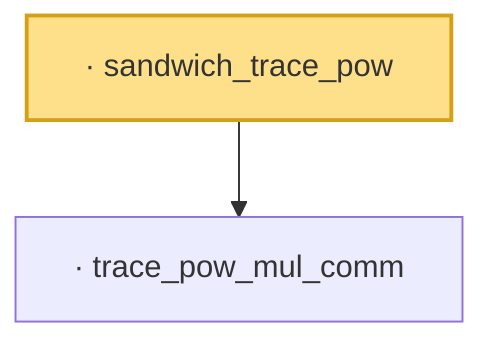

# Proof narrative — sandwich_trace_pow

Root: **sandwich_trace_pow** (lemma) `Statlib/HighDim/MatrixAnalysis/LiebThirring.lean:221` · topic `HighDim`
Closure: 2 declarations across 1 files. Generated from `proof_graph.json` — no files were moved.

Reading order (foundations first, headline last):

  · `trace_pow_mul_comm` — lemma · `Statlib/HighDim/MatrixAnalysis/LiebThirring.lean:183`
· `sandwich_trace_pow` — lemma · `Statlib/HighDim/MatrixAnalysis/LiebThirring.lean:221` **← headline**

## Dependency diagram

