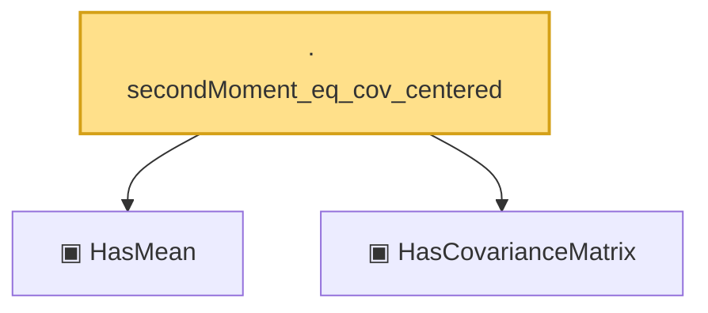

# Proof narrative — secondMoment_eq_cov_centered

Root: **secondMoment_eq_cov_centered** (lemma) `Statlib/HighDim/CovarianceMatrix/Properties.lean:115` · topic `HighDim`
Closure: 3 declarations across 2 files. Generated from `proof_graph.json` — no files were moved.

Reading order (foundations first, headline last):

  ▣ `HasMean` — structure · `Statlib/HighDim/Vocabulary/RandomVector.lean:83`  _(also used by 60: coord_mul_integral_eq_zero_of_indep, offDiagQuadForm_integral_eq_zero_of_indep, offDiagQuadForm_centered_eq_self_of_indep, …)_
  ▣ `HasCovarianceMatrix` — structure · `Statlib/HighDim/Vocabulary/RandomVector.lean:101`  _(also used by 18: cov_quadratic_deviation, secondMoment_isSymm, secondMoment_posSemidef, …)_
· `secondMoment_eq_cov_centered` — lemma · `Statlib/HighDim/CovarianceMatrix/Properties.lean:115` **← headline**

## Dependency diagram

