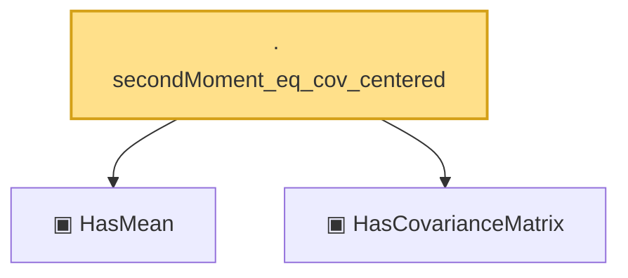

# Proof narrative — secondMoment_eq_cov_centered

Root: **secondMoment_eq_cov_centered** (lemma) `Statlib/HighDim/Properties.lean:52` · topic `HighDim`
Closure: 3 declarations across 2 files. Generated from `proof_graph.json` — no files were moved.

Reading order (foundations first, headline last):

  ▣ `HasMean` — structure · `Statlib/Vocabulary/RandomVector.lean:83`  _(also used by 10: hanson_wright, hanson_wright_isotropic, subgaussian_variance_bound, …)_
  ▣ `HasCovarianceMatrix` — structure · `Statlib/Vocabulary/RandomVector.lean:101`  _(also used by 8: secondMoment_isSymm, secondMoment_posSemidef, subgaussian_variance_bound, …)_
· `secondMoment_eq_cov_centered` — lemma · `Statlib/HighDim/Properties.lean:52` **← headline**

## Dependency diagram

