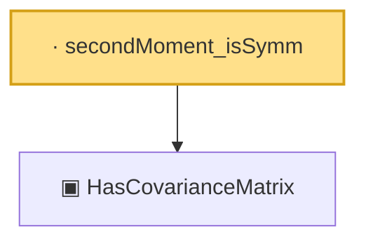

# Proof narrative — secondMoment_isSymm

Root: **secondMoment_isSymm** (lemma) `Statlib/HighDim/Properties.lean:31` · topic `HighDim`
Closure: 2 declarations across 2 files. Generated from `proof_graph.json` — no files were moved.

Reading order (foundations first, headline last):

  ▣ `HasCovarianceMatrix` — structure · `Statlib/Vocabulary/RandomVector.lean:101`  _(also used by 8: secondMoment_posSemidef, secondMoment_eq_cov_centered, subgaussian_variance_bound, …)_
· `secondMoment_isSymm` — lemma · `Statlib/HighDim/Properties.lean:31` **← headline**

## Dependency diagram

