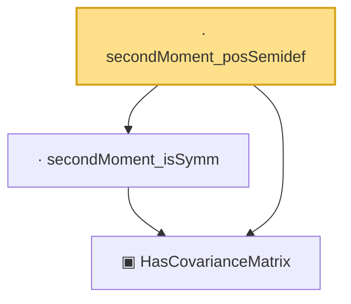

# Proof narrative — secondMoment_posSemidef

Root: **secondMoment_posSemidef** (lemma) `Statlib/HighDim/CovarianceMatrix/Properties.lean:52` · topic `HighDim`
Closure: 3 declarations across 2 files. Generated from `proof_graph.json` — no files were moved.

Reading order (foundations first, headline last):

  ▣ `HasCovarianceMatrix` — structure · `Statlib/HighDim/Vocabulary/RandomVector.lean:101`  _(also used by 19: cov_diagonal_concentration, cov_quadratic_deviation, cov_trace_concentration, …)_
  · `secondMoment_isSymm` — lemma · `Statlib/HighDim/CovarianceMatrix/Properties.lean:33`
· `secondMoment_posSemidef` — lemma · `Statlib/HighDim/CovarianceMatrix/Properties.lean:52` **← headline**

## Dependency diagram

