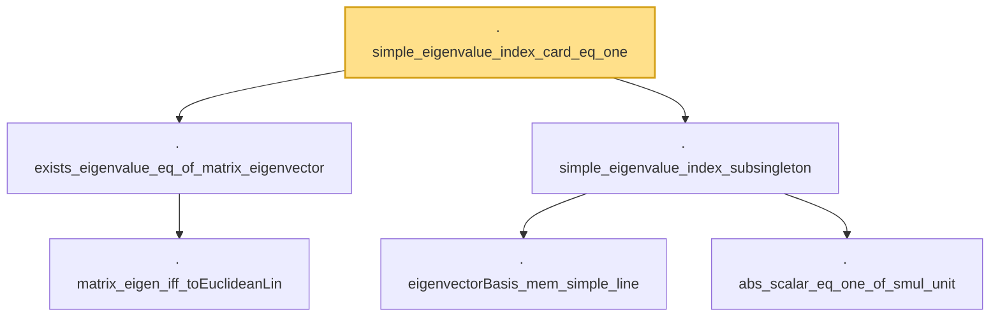

# Proof narrative — simple_eigenvalue_index_card_eq_one

Root: **simple_eigenvalue_index_card_eq_one** (lemma) `Statlib/HighDim/SpectralPerturbation/Eigenvalues.lean:699` · topic `HighDim`
Closure: 6 declarations across 1 files. Generated from `proof_graph.json` — no files were moved.

Reading order (foundations first, headline last):

    · `matrix_eigen_iff_toEuclideanLin` — lemma · `Statlib/HighDim/SpectralPerturbation/Eigenvalues.lean:603`
  · `exists_eigenvalue_eq_of_matrix_eigenvector` — lemma · `Statlib/HighDim/SpectralPerturbation/Eigenvalues.lean:615`  _(also used by 2: davis_kahan_eigvec, exists_perturbed_unit_eigenvector_near)_
    · `eigenvectorBasis_mem_simple_line` — lemma · `Statlib/HighDim/SpectralPerturbation/Eigenvalues.lean:638`  _(also used by 1: davis_kahan_eigvec)_
    · `abs_scalar_eq_one_of_smul_unit` — lemma · `Statlib/HighDim/SpectralPerturbation/Eigenvalues.lean:650`  _(also used by 1: davis_kahan_eigvec)_
  · `simple_eigenvalue_index_subsingleton` — lemma · `Statlib/HighDim/SpectralPerturbation/Eigenvalues.lean:658`  _(also used by 1: target_energy_eq_single_coeff_sq)_
· `simple_eigenvalue_index_card_eq_one` — lemma · `Statlib/HighDim/SpectralPerturbation/Eigenvalues.lean:699` **← headline**

## Dependency diagram

