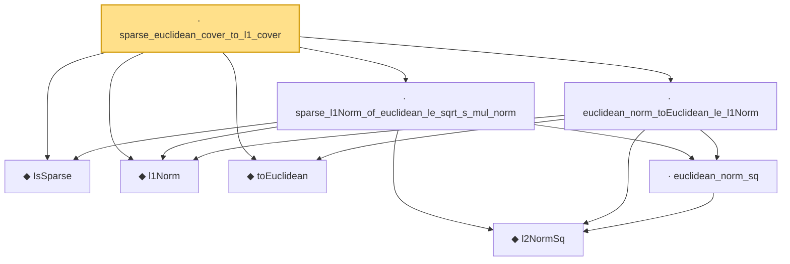

# Proof narrative — sparse_euclidean_cover_to_l1_cover

Root: **sparse_euclidean_cover_to_l1_cover** (lemma) `Statlib/HighDim/Geometry/CoveringNumbers.lean:1123` · topic `HighDim`
Closure: 8 declarations across 3 files. Generated from `proof_graph.json` — no files were moved.

Reading order (foundations first, headline last):

  ◆ `IsSparse` — def · `Statlib/HighDim/Vocabulary/Sparse.lean:36`  _(also used by 48: threshold_head_quadratic_remainder_abs_from_bilinear_l2_tail, subgaussian_l1_shell_localized_centered_tail_from_sparse_approximation_cover, subgaussian_l1_shell_localized_centered_tail_from_sparse_ball_approximation_cover, …)_
  ◆ `l1Norm` — noncomputable def · `Statlib/HighDim/Vocabulary/Norms.lean:17`  _(also used by 202: l1_linear_rademacher_complexity_bound, finite_l1_quadratic_rademacher_coord_bound, finite_l1_quadratic_rademacher_coord_energy_bound, …)_
  ◆ `toEuclidean` — noncomputable def · `Statlib/HighDim/Vocabulary/Norms.lean:109`  _(also used by 18: sampleSecondMoment_quadratic_eq_l2NormSq_div, sampleSecondMoment_unit_direction_lower_tail_double_sum, hermitian_norm_le_two_net_sup, …)_
    ◆ `l2NormSq` — noncomputable def · `Statlib/HighDim/Vocabulary/Norms.lean:13`  _(also used by 219: matrixRowVec_norm_sq, offDiagCoeffVec_norm_sq_le_frobenius, offDiagCoeffVec_norm_sq_integral_le_frobenius, …)_
    · `euclidean_norm_sq` — lemma · `Statlib/HighDim/Vocabulary/Norms.lean:89`  _(also used by 30: matrixRowVec_norm_sq, offDiagCoeffVec_norm_sq_le_frobenius, offDiagCoeffVec_norm_sq_integral_le_frobenius, …)_
  · `euclidean_norm_toEuclidean_le_l1Norm` — lemma · `Statlib/HighDim/Geometry/CoveringNumbers.lean:869`  _(also used by 1: normalized_sparse_euclidean_cover_to_unit_l1_cover)_
  · `sparse_l1Norm_of_euclidean_le_sqrt_s_mul_norm` — lemma · `Statlib/HighDim/Geometry/CoveringNumbers.lean:813`  _(also used by 2: normalized_sparse_euclidean_cover_to_unit_l1_cover, nuclear_norm_le_sqrt_rank_mul_frobenius)_
· `sparse_euclidean_cover_to_l1_cover` — lemma · `Statlib/HighDim/Geometry/CoveringNumbers.lean:1123` **← headline**

## Dependency diagram

