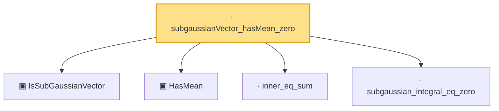

# Proof narrative — subgaussianVector_hasMean_zero

Root: **subgaussianVector_hasMean_zero** (lemma) `Statlib/HighDim/Geometry/RIPConstruction.lean:47` · topic `HighDim`
Closure: 5 declarations across 4 files. Generated from `proof_graph.json` — no files were moved.

Reading order (foundations first, headline last):

  ▣ `IsSubGaussianVector` — structure · `Statlib/HighDim/Vocabulary/RandomVector.lean:52`  _(also used by 79: decoupledOffDiagQuadForm_const_right_subgaussian, decoupledOffDiagQuadForm_const_right_abs_tail_real, decoupledOffDiagQuadForm_prod_first_section_abs_tail_real, …)_
  ▣ `HasMean` — structure · `Statlib/HighDim/Vocabulary/RandomVector.lean:83`  _(also used by 38: coord_mul_integral_eq_zero_of_indep, offDiagQuadForm_integral_eq_zero_of_indep, offDiagQuadForm_centered_eq_self_of_indep, …)_
  · `inner_eq_sum` — lemma · `Statlib/HighDim/Vocabulary/Norms.lean:32`  _(also used by 13: decoupledOffDiagQuadForm_eq_inner_coeff, offDiagCoeffVec_apply_eq_inner_row_zeroDiag, subgaussian_vector_coord, …)_
  · `subgaussian_integral_eq_zero` — lemma · `Statlib/StatFoundation/RandomVariable/SubGaussian/subgaussian_integral_eq_zero.lean:12`  _(also used by 2: cov_trace_concentration, subgaussian_prod_subexponential)_
· `subgaussianVector_hasMean_zero` — lemma · `Statlib/HighDim/Geometry/RIPConstruction.lean:47` **← headline**

## Dependency diagram

