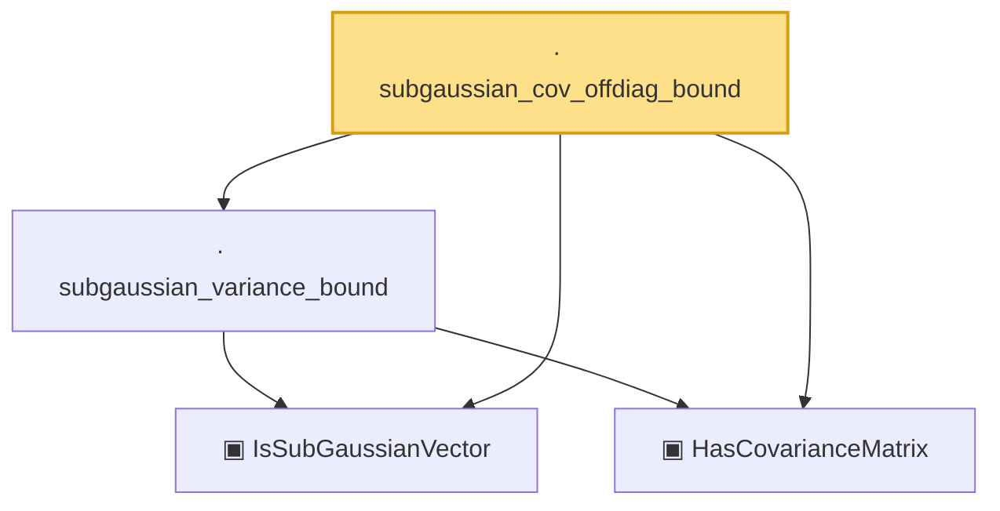

# Proof narrative — subgaussian_cov_offdiag_bound

Root: **subgaussian_cov_offdiag_bound** (lemma) `Statlib/HighDim/CovarianceMatrix/Properties.lean:353` · topic `HighDim`
Closure: 4 declarations across 2 files. Generated from `proof_graph.json` — no files were moved.

Reading order (foundations first, headline last):

  ▣ `IsSubGaussianVector` — structure · `Statlib/HighDim/Vocabulary/RandomVector.lean:52`  _(also used by 77: decoupledOffDiagQuadForm_const_right_subgaussian, decoupledOffDiagQuadForm_const_right_abs_tail_real, decoupledOffDiagQuadForm_prod_first_section_abs_tail_real, …)_
  ▣ `HasCovarianceMatrix` — structure · `Statlib/HighDim/Vocabulary/RandomVector.lean:101`  _(also used by 20: cov_diagonal_concentration, cov_quadratic_deviation, cov_trace_concentration, …)_
  · `subgaussian_variance_bound` — lemma · `Statlib/HighDim/CovarianceMatrix/Properties.lean:142`  _(also used by 1: subgaussian_rip_tail_anisotropic)_
· `subgaussian_cov_offdiag_bound` — lemma · `Statlib/HighDim/CovarianceMatrix/Properties.lean:353` **← headline**

## Dependency diagram

