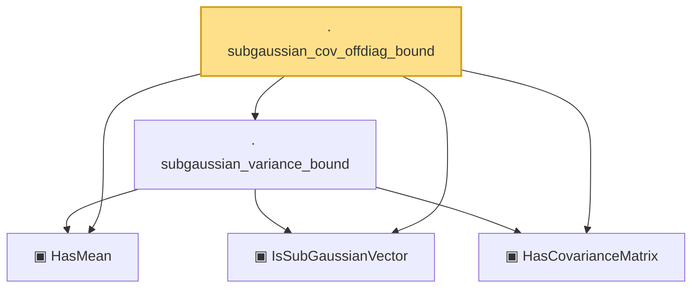

# Proof narrative — subgaussian_cov_offdiag_bound

Root: **subgaussian_cov_offdiag_bound** (lemma) `Statlib/HighDim/CovarianceMatrix/Properties.lean:342` · topic `HighDim`
Closure: 5 declarations across 2 files. Generated from `proof_graph.json` — no files were moved.

Reading order (foundations first, headline last):

  ▣ `HasMean` — structure · `Statlib/HighDim/Vocabulary/RandomVector.lean:83`  _(also used by 56: coord_mul_integral_eq_zero_of_indep, offDiagQuadForm_integral_eq_zero_of_indep, offDiagQuadForm_centered_eq_self_of_indep, …)_
  ▣ `IsSubGaussianVector` — structure · `Statlib/HighDim/Vocabulary/RandomVector.lean:52`  _(also used by 72: decoupledOffDiagQuadForm_const_right_subgaussian, decoupledOffDiagQuadForm_const_right_abs_tail_real, decoupledOffDiagQuadForm_prod_first_section_abs_tail_real, …)_
  ▣ `HasCovarianceMatrix` — structure · `Statlib/HighDim/Vocabulary/RandomVector.lean:101`  _(also used by 14: secondMoment_isSymm, secondMoment_posSemidef, secondMoment_eq_cov_centered, …)_
  · `subgaussian_variance_bound` — lemma · `Statlib/HighDim/CovarianceMatrix/Properties.lean:140`
· `subgaussian_cov_offdiag_bound` — lemma · `Statlib/HighDim/CovarianceMatrix/Properties.lean:342` **← headline**

## Dependency diagram

