# Proof narrative — subgaussian_l1_shell_centered_quadratic_deviation_tail_from_interval_endpoint_inputs

Root: **subgaussian_l1_shell_centered_quadratic_deviation_tail_from_interval_endpoint_inputs** (theorem) `Statlib/HighDim/CovarianceMatrix/L1QuadraticProcess/RadiusFluctuation.lean:2923` · topic `HighDim`
Closure: 55 declarations across 12 files. Generated from `proof_graph.json` — no files were moved.

Reading order (foundations first, headline last):

  ▣ `HasMean` — structure · `Statlib/HighDim/Vocabulary/RandomVector.lean:83`  _(also used by 117: frobenius_norm_sq_subgaussian_concentration, gaussian_quadratic_form_concentration, coord_mul_integral_eq_zero_of_indep, …)_
  ▣ `HasCovarianceMatrix` — structure · `Statlib/HighDim/Vocabulary/RandomVector.lean:101`  _(also used by 109: cov_diagonal_concentration, cov_quadratic_deviation, cov_quadratic_deviation_unit_shifted_lower_tail, …)_
  ▣ `IsSubGaussianVector` — structure · `Statlib/HighDim/Vocabulary/RandomVector.lean:52`  _(also used by 167: frobenius_norm_sq_subgaussian_concentration, gaussian_quadratic_form_concentration, decoupledOffDiagQuadForm_const_right_subgaussian, …)_
  ◆ `sampleSecondMoment` — noncomputable def · `Statlib/HighDim/CovarianceMatrix/SampleCovariance.lean:199`  _(also used by 48: finite_l1_quadratic_rademacher_sample_envelope_entrywise_good_bound, sample_covariance_entry_centered_representation, sample_covariance_entry_bad_event_eq_centered_product_event, …)_
  ◆ `l2NormSq` — noncomputable def · `Statlib/HighDim/Vocabulary/Norms.lean:13`  _(also used by 193: matrixRowVec_norm_sq, offDiagCoeffVec_norm_sq_le_frobenius, offDiagCoeffVec_norm_sq_integral_le_frobenius, …)_
  ◆ `l1Norm` — noncomputable def · `Statlib/HighDim/Vocabulary/Norms.lean:17`  _(also used by 176: l1_linear_rademacher_complexity_bound, finite_l1_quadratic_rademacher_coord_bound, finite_l1_quadratic_rademacher_coord_energy_bound, …)_
            · `inner_eq_sum` — lemma · `Statlib/HighDim/Vocabulary/Norms.lean:100`  _(also used by 17: decoupledOffDiagQuadForm_eq_inner_coeff, offDiagCoeffVec_apply_eq_inner_row_zeroDiag, subgaussian_vector_coord, …)_
            ▣ `HasSubexponentialMGF` — structure · `Statlib/StatFoundation/Vocabulary/RandomVariable.lean:74`  _(also used by 31: coord_mul_subexponential_exists_of_indep, subexponential_mgf_const_mul_relaxed, coord_mul_scaled_subexponential_exists_of_indep, …)_
            · `subexponential_mgf_mono_b` — lemma · `Statlib/HighDim/Concentration/HansonWright.lean:1916`  _(also used by 1: cov_quadratic_deviation)_
            ★ `subexp_mean_meas_ge_le_exp` — theorem · `Statlib/StatFoundation/Concentration/ExponentialType/subexp_mean_meas_ge_le_exp.lean:11`  _(also used by 1: cov_quadratic_deviation)_
            ★ `cov_quadratic_deviation_uniform_const` — theorem · `Statlib/HighDim/CovarianceMatrix/CovQuadraticDeviation.lean:459`  _(also used by 2: cov_quadratic_deviation_unit_shifted_lower_tail, coordinate_product_tail_from_fixed_direction_quadratic_deviation)_
            · `euclidean_norm_sq` — lemma · `Statlib/HighDim/Vocabulary/Norms.lean:89`  _(also used by 30: matrixRowVec_norm_sq, offDiagCoeffVec_norm_sq_le_frobenius, offDiagCoeffVec_norm_sq_integral_le_frobenius, …)_
            ★ `subgaussian_variance_le` — theorem · `Statlib/StatFoundation/RandomVariable/SubGaussian/subgaussian_variance_le.lean:8`  _(also used by 2: subgaussian_projection_second_moment_le, subgaussian_rip_tail)_
            ★ `subgaussian_cov_quadratic_unit_le_sigma_sq` — theorem · `Statlib/HighDim/CovarianceMatrix/Properties.lean:354`  _(also used by 3: cov_quadratic_deviation_unit_shifted_lower_tail, l1_shell_bad_event_implies_large_l2NormSq_of_subgaussian_covariance, kappa_le_sigma_sq_from_subgaussian_rows)_
            ★ `cov_quadratic_deviation_unit_lower_tail` — theorem · `Statlib/HighDim/CovarianceMatrix/CovQuadraticDeviation.lean:1021`  _(also used by 1: finite_grid_fixed_direction_tail_from_cov_lower_tail)_
          ◆ `toEuclidean` — noncomputable def · `Statlib/HighDim/Vocabulary/Norms.lean:109`  _(also used by 16: hermitian_norm_le_two_net_sup, sample_covariance_quadratic_eq_centered_projection_sum, sampleCovariance_concentration, …)_
          · `matrix_quadratic_eq_sum` — lemma · `Statlib/HighDim/CovarianceMatrix/SampleCovariance.lean:342`  _(also used by 3: sample_covariance_quadratic_eq_centered_projection_sum, restricted_sample_deviation_quadratic, design_l2NormSq_div_eq_sampleSecondMoment_quadratic)_
            · `fin_sum_comm_three` — lemma · `Statlib/HighDim/CovarianceMatrix/SampleCovariance.lean:354`
          · `sampleSecondMoment_quadratic_eq_projection_sum` — lemma · `Statlib/HighDim/CovarianceMatrix/SampleCovariance.lean:364`  _(also used by 3: sample_covariance_quadratic_eq_centered_projection_sum, restricted_sample_deviation_quadratic, design_l2NormSq_div_eq_sampleSecondMoment_quadratic)_
          ★ `sampleSecondMoment_unit_direction_lower_tail_double_sum` — theorem · `Statlib/HighDim/CovarianceMatrix/L1QuadraticProcess/RadiusFluctuation.lean:21`
            · `cov_quadratic_form_scaled_vector_eq` — lemma · `Statlib/HighDim/CovarianceMatrix/L1QuadraticProcess.lean:3975`  _(also used by 3: l1_grid_bad_event_subset_scaled_fixed_direction_event_of_repr, l1_lower_of_unit_l1_lower, sparse_l1_lower_of_unit_sparse_l1_lower)_
      · `l1Norm_eq_one_l2NormSq_pos` — lemma · `Statlib/HighDim/CovarianceMatrix/L1QuadraticProcess.lean:4357`  _(also used by 1: exists_scaled_unit_direction_of_l1Norm_eq_one)_
            · `l1Norm_smul` — lemma · `Statlib/HighDim/Geometry/CoveringNumbers.lean:1330`  _(also used by 2: l1Norm_inv_smul_eq_one, normalized_l1_distance_le_two_mul)_
            · `l1_shell_normalized_l2_l1_cap_of_dyadic_lower` — lemma · `Statlib/HighDim/CovarianceMatrix/L1QuadraticProcess/RadiusFluctuation.lean:100`
            · `l1_shell_dyadic_scale_bad_event_witness` — lemma · `Statlib/HighDim/CovarianceMatrix/L1QuadraticProcess/RadiusFluctuation.lean:143`
            · `positive_eps_from_half_slack_budget` — lemma · `Statlib/HighDim/CovarianceMatrix/L1QuadraticProcess/RadiusFluctuation.lean:690`
            · `l1Norm_le_sqrt_card_mul_sqrt_l2NormSq` — lemma · `Statlib/HighDim/CovarianceMatrix/L1QuadraticProcess.lean:6215`  _(also used by 4: bilinear_form_entrywise_abs_le_card_mul_sqrt_l2NormSq, l2_radius_to_l1_radius, matrix_entrywise_good_to_radius_fluctuation, …)_
            · `l1Norm_sub_triangle` — lemma · `Statlib/HighDim/Geometry/CoveringNumbers.lean:1315`  _(also used by 3: cover_center_l1_bound_from_l2_radius, normalized_l1_distance_le_two_mul, normalized_sparse_euclidean_cover_to_unit_l1_cover)_
            · `abs_sum_mul_le_l1Norm_mul_coord_bound` — lemma · `Statlib/HighDim/Vocabulary/Norms.lean:38`  _(also used by 6: l1_linear_rademacher_complexity_bound, finite_l1_quadratic_rademacher_coord_bound, finite_l1_quadratic_rademacher_sample_envelope_entrywise_good_bound, …)_
            · `bilinear_form_entrywise_abs_le_l1Norm_mul_l1Norm` — lemma · `Statlib/HighDim/CovarianceMatrix/L1QuadraticProcess.lean:1117`  _(also used by 5: quadratic_form_l1_lipschitz_of_entrywise_bound, bilinear_form_entrywise_abs_le_card_mul_sqrt_l2NormSq, quadratic_form_l1_lipschitz_of_entrywise_bound_cap, …)_
            · `quadratic_form_l1_lipschitz_of_entrywise_bound_two_caps_aux` — private lemma · `Statlib/HighDim/CovarianceMatrix/L1QuadraticProcess/RadiusFluctuation.lean:873`
            · `matrix_entrywise_good_to_radius_fluctuation_two_caps` — lemma · `Statlib/HighDim/CovarianceMatrix/L1QuadraticProcess/RadiusFluctuation.lean:969`
            · `good_event_to_radius_fluctuation_certificate` — lemma · `Statlib/HighDim/CovarianceMatrix/L1QuadraticProcess/RadiusFluctuation.lean:712`
            · `matrix_entrywise_good_to_radius_fluctuation_certificate_two_caps` — lemma · `Statlib/HighDim/CovarianceMatrix/L1QuadraticProcess/RadiusFluctuation.lean:1064`  _(also used by 1: l1_shell_scale_bad_measure_le_exp_card_tail_of_matrix_entrywise_good_cover_two_caps)_
            · `l1_shell_cover_good_from_matrix_entrywise_good_cover_two_caps` — lemma · `Statlib/HighDim/CovarianceMatrix/L1QuadraticProcess/RadiusFluctuation.lean:1232`
            · `l1_shell_cover_good_from_radius_cover_exists_entrywise_tail` — lemma · `Statlib/HighDim/CovarianceMatrix/L1QuadraticProcess/RadiusFluctuation.lean:1468`
            · `l1_shell_radius_budget_of_l1_delta_budget` — lemma · `Statlib/HighDim/CovarianceMatrix/L1QuadraticProcess/RadiusFluctuation.lean:1418`
            · `l1_shell_cover_good_from_delta_budget_cover_exists_entrywise_tail` — lemma · `Statlib/HighDim/CovarianceMatrix/L1QuadraticProcess/RadiusFluctuation.lean:1529`
            · `finite_const_ennreal_sum_ofReal_le` — lemma · `Statlib/HighDim/CovarianceMatrix/L1QuadraticProcess.lean:752`  _(also used by 1: finite_grid_exponential_cardinality_absorption)_
            · `l1_shell_scale_bad_measure_le_exp_card_tail_of_radius_fluctuation_cover` — lemma · `Statlib/HighDim/CovarianceMatrix/L1QuadraticProcess/RadiusFluctuation.lean:311`  _(also used by 1: l1_shell_scale_bad_measure_le_exp_card_tail_of_matrix_entrywise_good_cover_two_caps)_
            · `l1_shell_scale_measure_bound_from_cover_good_matrix_certificate` — lemma · `Statlib/HighDim/CovarianceMatrix/L1QuadraticProcess/RadiusFluctuation.lean:1297`
            · `l1_shell_sum_scale_measure_bound_from_cover_good_matrix_certificate_indexed` — lemma · `Statlib/HighDim/CovarianceMatrix/L1QuadraticProcess/RadiusFluctuation.lean:1992`
            · `l1_shell_sum_scale_measure_bound_from_delta_budget_entrywise_cover_exists_absorbed` — lemma · `Statlib/HighDim/CovarianceMatrix/L1QuadraticProcess/RadiusFluctuation.lean:2071`
          · `l1_shell_sum_dyadic_scale_measure_bound_from_delta_budget_entrywise_cover_exists_absorbed` — lemma · `Statlib/HighDim/CovarianceMatrix/L1QuadraticProcess/RadiusFluctuation.lean:2197`
        ★ `l1_shell_sample_covariance_dyadic_sum_from_delta_budget_entrywise_cover_exists_absorbed` — theorem · `Statlib/HighDim/CovarianceMatrix/L1QuadraticProcess/RadiusFluctuation.lean:2322`
      ★ `subgaussian_l1_shell_centered_quadratic_deviation_tail_from_dyadic_sample_assembly_explicit_inputs` — theorem · `Statlib/HighDim/CovarianceMatrix/L1QuadraticProcess/RadiusFluctuation.lean:2502`
          · `matrix_mulVec_l2NormSq_eq_sum_inner_sq` — lemma · `Statlib/HighDim/CovarianceMatrix/L1QuadraticProcess.lean:910`  _(also used by 1: l1_grid_bad_event_subset_scaled_fixed_direction_event_of_repr)_
        · `sampleSecondMoment_quadratic_eq_l2NormSq_div` — lemma · `Statlib/HighDim/CovarianceMatrix/L1QuadraticProcess.lean:2802`  _(also used by 3: l1_shell_sample_covariance_good_cover_from_entrywise_bounds, centered_quadratic_sampleSecondMoment_representation, l1_lower_from_threshold_head_bilinear_remainders)_
      · `l1_shell_centered_bad_subset_dyadic_sample_scale_bad_union_from_locator` — lemma · `Statlib/HighDim/CovarianceMatrix/L1QuadraticProcess/RadiusFluctuation.lean:2444`
    ★ `subgaussian_l1_shell_centered_quadratic_deviation_tail_from_dyadic_locator_inputs` — theorem · `Statlib/HighDim/CovarianceMatrix/L1QuadraticProcess/RadiusFluctuation.lean:2646`
  ★ `subgaussian_l1_shell_centered_quadratic_deviation_tail_from_dyadic_endpoint_inputs` — theorem · `Statlib/HighDim/CovarianceMatrix/L1QuadraticProcess/RadiusFluctuation.lean:2750`  _(also used by 1: subgaussian_l1_shell_centered_quadratic_deviation_tail_from_finite_interval_endpoint_inputs)_
      · `l2NormSq_le_l1Norm_sq` — lemma · `Statlib/HighDim/Vocabulary/Norms.lean:21`  _(also used by 3: quadratic_remainder_abs_from_bilinear_l2_tail, l1_shell_dyadic_endpoint_cover_from_finite_interval, l1RSE_of_tolerance_dominates)_
    · `l1_shell_l2NormSq_pos_le_one` — lemma · `Statlib/HighDim/CovarianceMatrix/L1QuadraticProcess/RadiusFluctuation.lean:2851`
  · `l1_shell_dyadic_endpoint_cover_from_unit_interval` — lemma · `Statlib/HighDim/CovarianceMatrix/L1QuadraticProcess/RadiusFluctuation.lean:2873`
★ `subgaussian_l1_shell_centered_quadratic_deviation_tail_from_interval_endpoint_inputs` — theorem · `Statlib/HighDim/CovarianceMatrix/L1QuadraticProcess/RadiusFluctuation.lean:2923` **← headline**

## Dependency diagram

```mermaid
flowchart TD
  n0["▣ HasMean"]
  n1["▣ HasCovarianceMatrix"]
  n2["▣ IsSubGaussianVector"]
  n3["◆ sampleSecondMoment"]
  n4["◆ l2NormSq"]
  n5["◆ l1Norm"]
  n6["· inner_eq_sum"]
  n7["▣ HasSubexponentialMGF"]
  n8["· subexponential_mgf_mono_b"]
  n9["★ subexp_mean_meas_ge_le_exp"]
  n10["★ cov_quadratic_deviation_uniform_const"]
  n11["· euclidean_norm_sq"]
  n12["★ subgaussian_variance_le"]
  n13["★ subgaussian_cov_quadratic_unit_le_sigma_sq"]
  n14["★ cov_quadratic_deviation_unit_lower_tail"]
  n15["◆ toEuclidean"]
  n16["· matrix_quadratic_eq_sum"]
  n17["· fin_sum_comm_three"]
  n18["· sampleSecondMoment_quadratic_eq_projection_sum"]
  n19["★ sampleSecondMoment_unit_direction_lower_tail_double_sum"]
  n20["· cov_quadratic_form_scaled_vector_eq"]
  n21["· l1Norm_eq_one_l2NormSq_pos"]
  n22["· l1Norm_smul"]
  n23["· l1_shell_normalized_l2_l1_cap_of_dyadic_lower"]
  n24["· l1_shell_dyadic_scale_bad_event_witness"]
  n25["· positive_eps_from_half_slack_budget"]
  n26["· l1Norm_le_sqrt_card_mul_sqrt_l2NormSq"]
  n27["· l1Norm_sub_triangle"]
  n28["· abs_sum_mul_le_l1Norm_mul_coord_bound"]
  n29["· bilinear_form_entrywise_abs_le_l1Norm_mul_l1Norm"]
  n30["· quadratic_form_l1_lipschitz_of_entrywise_bound_two_caps_aux"]
  n31["· matrix_entrywise_good_to_radius_fluctuation_two_caps"]
  n32["· good_event_to_radius_fluctuation_certificate"]
  n33["· matrix_entrywise_good_to_radius_fluctuation_certificate_two_caps"]
  n34["· l1_shell_cover_good_from_matrix_entrywise_good_cover_two_caps"]
  n35["· l1_shell_cover_good_from_radius_cover_exists_entrywise_tail"]
  n36["· l1_shell_radius_budget_of_l1_delta_budget"]
  n37["· l1_shell_cover_good_from_delta_budget_cover_exists_entrywise_tail"]
  n38["· finite_const_ennreal_sum_ofReal_le"]
  n39["· l1_shell_scale_bad_measure_le_exp_card_tail_of_radius_fluctuation_cover"]
  n40["· l1_shell_scale_measure_bound_from_cover_good_matrix_certificate"]
  n41["· l1_shell_sum_scale_measure_bound_from_cover_good_matrix_certificate_indexed"]
  n42["· l1_shell_sum_scale_measure_bound_from_delta_budget_entrywise_cover_exists_absorbed"]
  n43["· l1_shell_sum_dyadic_scale_measure_bound_from_delta_budget_entrywise_cover_exists_absorbed"]
  n44["★ l1_shell_sample_covariance_dyadic_sum_from_delta_budget_entrywise_cover_exists_absorbed"]
  n45["★ subgaussian_l1_shell_centered_quadratic_deviation_tail_from_dyadic_sample_assembly_explicit_inputs"]
  n46["· matrix_mulVec_l2NormSq_eq_sum_inner_sq"]
  n47["· sampleSecondMoment_quadratic_eq_l2NormSq_div"]
  n48["· l1_shell_centered_bad_subset_dyadic_sample_scale_bad_union_from_locator"]
  n49["★ subgaussian_l1_shell_centered_quadratic_deviation_tail_from_dyadic_locator_inputs"]
  n50["★ subgaussian_l1_shell_centered_quadratic_deviation_tail_from_dyadic_endpoint_inputs"]
  n51["· l2NormSq_le_l1Norm_sq"]
  n52["· l1_shell_l2NormSq_pos_le_one"]
  n53["· l1_shell_dyadic_endpoint_cover_from_unit_interval"]
  n54["★ subgaussian_l1_shell_centered_quadratic_deviation_tail_from_interval_endpoint_inputs"]
  n8 --> n7
  n9 --> n7
  n10 --> n0
  n10 --> n1
  n10 --> n2
  n10 --> n6
  n10 --> n8
  n10 --> n9
  n11 --> n4
  n13 --> n2
  n13 --> n1
  n13 --> n6
  n13 --> n12
  n14 --> n0
  n14 --> n1
  n14 --> n2
  n14 --> n10
  n14 --> n4
  n14 --> n11
  n14 --> n13
  n16 --> n15
  n16 --> n6
  n18 --> n15
  n18 --> n3
  n18 --> n16
  n18 --> n17
  n18 --> n6
  n19 --> n0
  n19 --> n1
  n19 --> n2
  n19 --> n4
  n19 --> n3
  n19 --> n14
  n19 --> n15
  n19 --> n11
  n19 --> n16
  n19 --> n18
  n21 --> n5
  n21 --> n4
  n22 --> n5
  n23 --> n5
  n23 --> n4
  n23 --> n21
  n23 --> n22
  n24 --> n5
  n24 --> n4
  n24 --> n21
  n24 --> n23
  n26 --> n5
  n26 --> n4
  n27 --> n5
  n28 --> n5
  n29 --> n5
  n29 --> n28
  n30 --> n5
  n30 --> n29
  n31 --> n4
  n31 --> n5
  n31 --> n26
  n31 --> n27
  n31 --> n30
  n32 --> n4
  n32 --> n5
  n33 --> n4
  n33 --> n5
  n33 --> n25
  n33 --> n31
  n33 --> n32
  n34 --> n4
  n34 --> n5
  n34 --> n33
  n35 --> n4
  n35 --> n5
  n35 --> n34
  n37 --> n4
  n37 --> n5
  n37 --> n35
  n37 --> n36
  n39 --> n4
  n39 --> n5
  n39 --> n38
  n40 --> n4
  n40 --> n5
  n40 --> n39
  n41 --> n4
  n41 --> n5
  n41 --> n40
  n42 --> n4
  n42 --> n5
  n42 --> n37
  n42 --> n41
  n43 --> n4
  n43 --> n5
  n43 --> n20
  n43 --> n24
  n43 --> n42
  n44 --> n0
  n44 --> n1
  n44 --> n2
  n44 --> n3
  n44 --> n4
  n44 --> n5
  n44 --> n19
  n44 --> n43
  n45 --> n0
  n45 --> n1
  n45 --> n2
  n45 --> n3
  n45 --> n4
  n45 --> n5
  n45 --> n44
  n46 --> n4
  n47 --> n3
  n47 --> n4
  n47 --> n15
  n47 --> n16
  n47 --> n18
  n47 --> n46
  n48 --> n5
  n48 --> n4
  n48 --> n3
  n48 --> n47
  n49 --> n0
  n49 --> n1
  n49 --> n2
  n49 --> n3
  n49 --> n4
  n49 --> n5
  n49 --> n45
  n49 --> n48
  n50 --> n0
  n50 --> n1
  n50 --> n2
  n50 --> n3
  n50 --> n4
  n50 --> n5
  n50 --> n49
  n51 --> n4
  n51 --> n5
  n52 --> n5
  n52 --> n4
  n52 --> n21
  n52 --> n51
  n53 --> n5
  n53 --> n4
  n53 --> n52
  n54 --> n0
  n54 --> n1
  n54 --> n2
  n54 --> n3
  n54 --> n4
  n54 --> n5
  n54 --> n50
  n54 --> n53
  class n54 headline;
  classDef headline fill:#ffe08a,stroke:#d4a017,stroke-width:2px;
  classDef axiomNode fill:#ffd0d0,stroke:#c0392b,stroke-dasharray:4 2;
```

